# Lab 0: Setting up lab environment

# Exercise 1: Assign Power Apps trial license 

1.  Open a web browser on your VM and go to
    <https://powerapps.microsoft.com/en-us/free/> .

> 

2.  Select **Start free**.

> 

3.  Enter your **Office 365 admin credential**, check the checkbox to
    **accept the agreement** and click on **Start your free trial**.

> 

4.  Select **Yes** on Stay signed-in window.

> 

5.  Provide **Contact Information** as below and then select **Submit**.

> Email: **Office 365 admin tenant credentials**
>
> Country/region: **United States**
>
> Phone number: **Your phone number**
>
> 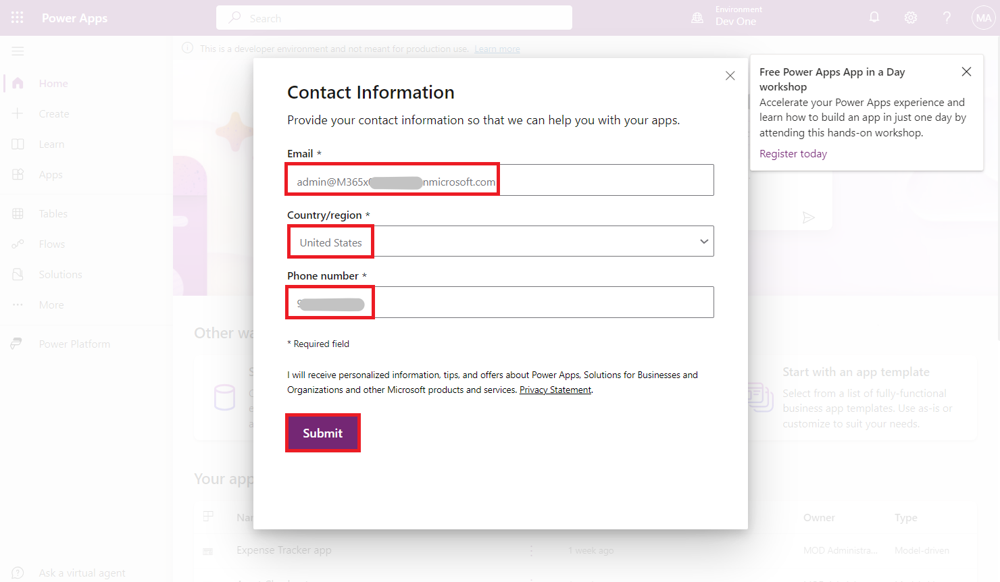

6.  You can now see **Home page of Power Apps** and the developer
    environment – **Dev One** is created for you.

> 

7.  Open the new tab and go to Power Platform admin center by navigating
    to <https://admin.powerplatform.microsoft.com> and if required, sign
    in using your given Office 365 tenant admin credentials. **Close**
    the **Pop-up window** saying, ‘Welcome to the Power Platform admin
    center’.

> 

8.  From the left navigation pane, select **Environments** and then you
    can see, **Dev One** is your Dataverse environment.

> 

9.  You can now proceed to next exercise.

# Exercise 2: Create a team in Microsoft Teams and enable Transcription in Teams

## Task 1: Create a team in Microsoft Teams

1.  Sign into the Microsoft Teams using <https://teams.microsoft.com/>
    with your Office 365 tenant credentials.

2.  Pop-up asks you to switch to the new Teams, select **Switch now**
    and follow the below instructions a and b.

1.  On Welcome to Teams window, select **Get Started**.

> 

2.  Close the window which is asking for scanning QR code.

> 

3.  On the left side of Teams, click **Teams**, at the bottom of the
    teams list, click + to  **Join or create a team**.

> 

4.  Click on **Create team**.

> 

5.  For old Teams, select **From a scratch**. If you have switched to
    new Teams, follow the below steps a, b and c and directly go to the
    step 8.

&nbsp;

1.  Enter the Team name – **Test Team**. Click on **Private**.

2.  Select **Org-wide**.

> 

3.  Select **Create** and go to step 8 directly.

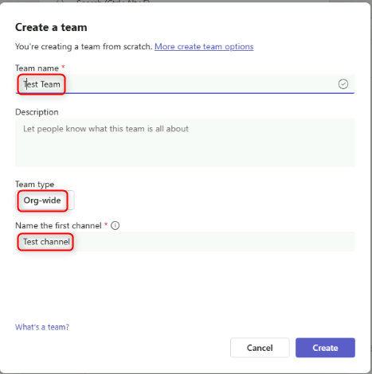

> 

6.  Select **Org-wide** for What kind of team this will be?

> 

7.  Give a **Name** to your team as **TestTeam** and click **Create**.

> 

8.  To create a channel within this team, select the team **TestTeam**
    that you created, click **More options ...** \> **Add channel.**

> 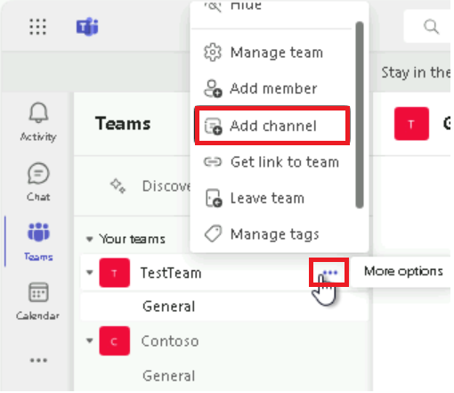

9.  Give a name to the Channel as **"TestChannel",** select the channel
    type as **Standard** and then click **Add/Create.**

> 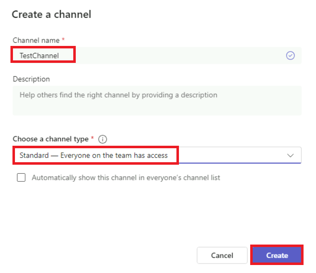

10. You can view the channel in teams when added.

> 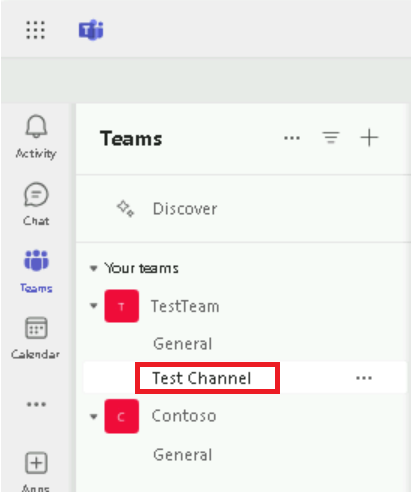

## Task 2: Enable Transcription in Teams

1.  Sign-in to the **Microsoft Teams admin center**
    <https://admin.teams.microsoft.com/dashboard>.

2.  From left navigation pane, select **Meetings** \> **Meeting
    policies**.

> Note: If you don’t find Meetings, click on Show all.
>
> 

3.  Select Global (Org-wide default) policy under manage policies tab.

> 

4.  Under Recording and transcription section, toggle **Transcription**
    button to **On** and then select **Save**.

> 

5.  Select **Confirm** to make changes.

> 

6.  From left navigation pane, select **Live events policies** under
    Meetings. Select **Global (Org-wide default)** policy.

> 

7.  Toggle the button for **Transcription for attendees** to **On** and
    then select **Save**.

> 

8.  Select **Confirm** to make changes.

> 

9.  From left navigation pane, under Voice, select **Calling policies**.
    Select **Global (Org-wide default)** policy.

> 

10. Toggle **Transcription** to **On** and then select **Save**.

> 

11. From left navigation pane, under Voice, select **Voicemail
    policies**. Select **Global (Org-wide default)** policy.

> 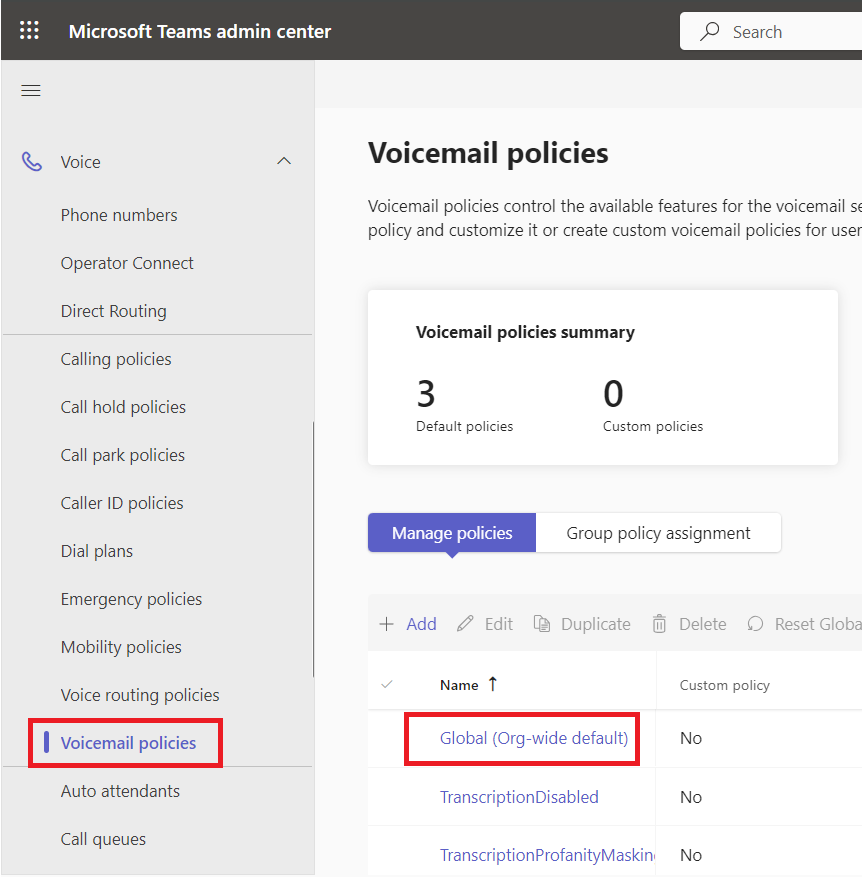

12. Toggle **Mask profanity in voicemail transcription** to **On** and
    then select **Save**.

> 

13. Select **Confirm** to make changes.

> 

# Exercise 3: Assign Customer Service trial license and enable Copilot

## Task 1: Assign Customer Service trial license

1.  Open your browser and browse to
    <https://dynamics.microsoft.com/en-in/customer-service/overview/>
    and select **Try for free**.

> 

2.  Enter your **Office 365 admin tenant credentials**, select the
    checkbox to **accept the agreement** and click on **Start your free
    trial**.

> 

3.  Provide **Contact Information** as below and then select **Submit**.

> Country/region: **United States**
>
> Phone number: **Your phone number**
>
> 

4.  If asked, enter your **Office 365 admin tenant password**.

> 

5.  On the pop up that appears, click **Launch Trial**.

> 

6.  You will be landed to the **Customer Service Workspace portal**.

7.  Go to **Power Platform admin center** by navigating to
    <https://admin.powerplatform.microsoft.com> and if required, sign in
    using your given **Office 365 tenant admin** credentials. You can
    see, **Customer Service Trial environment** is created.

> 

## Task 2: Enable Copilot feature

1.  Navigate back to **Customer Service workspace portal**. Select
    **Customer Service workspace** tab at the top.

> 

2.  Under apps, select **Customer Service Admin Center**.

> 

3.  Select **Productivity** under Agent experience.

4.  In the **Productivity Pane**, select **Manage** for the Copilot for
    questions and emails.

> 

5.  Under Select features, enable **Write an email**, **Ask a question**
    and then select the checkbox for Suggest a response. Similarly
    enable **Knowledge sources** and select the checkbox for **Record
    transcript** under Agent experience data.

> 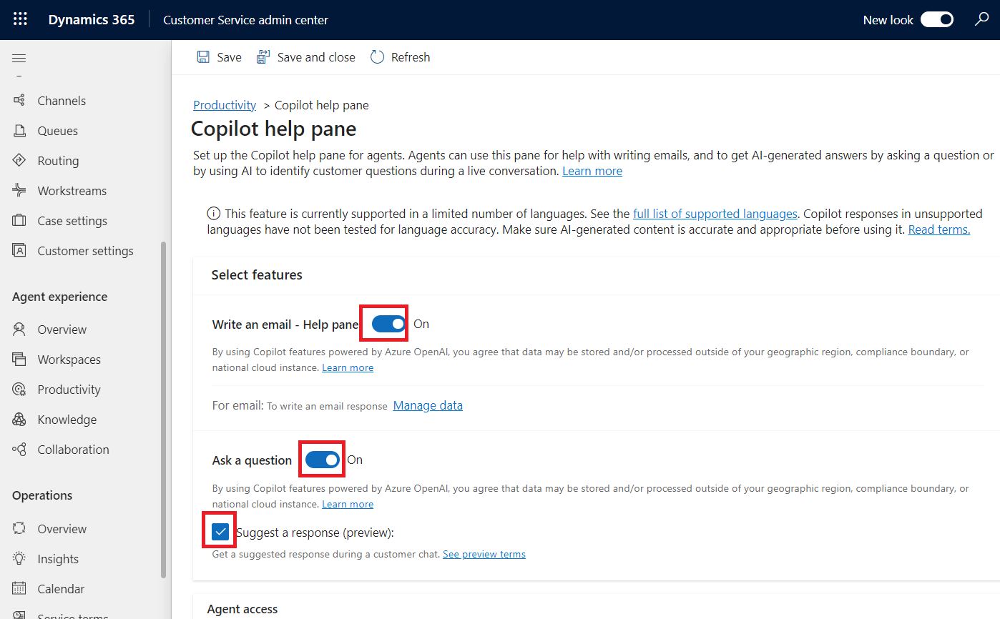

6.  Select **Save and close**.

> 

7.  Select **Manage** for **Summaries**.

> 

8.  If asked, provide your consent to use Copilot and then select **Opt
    in** to continue with the setup.

> 

9.  Select **Make case summaries available to agents** check box, select
    all the check boxes under **Live conversation summaries** and then
    select **Save**.

> 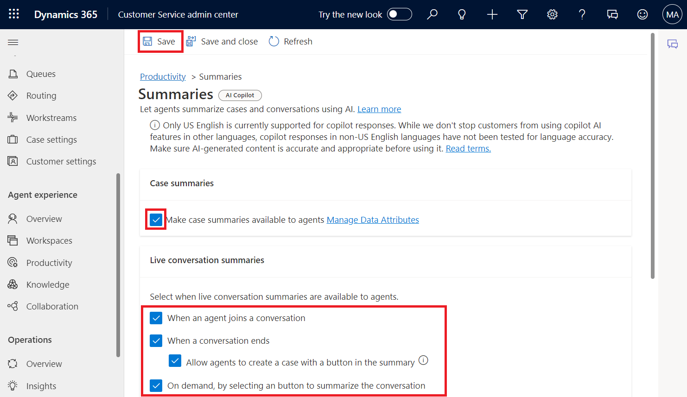

# Exercise 4: Assign Field Service trial license and install the Field Service Outlook Add-in

## Task 1: Assign Field Service trial license

1.  Navigate to the **Field Service product page** using the given link
    <https://www.microsoft.com/en-us/dynamics-365/products/field-service>
    and select the **Try for free** button.

2.  On the **Dynamics 365 free trials** page, select **Dynamics 365
    Field Service** and click **Try for free**.

3.  Enter your **Office 365 admin tenant** username, select the checkbox
    for service agreement and then select **Start your free trial**.

4.  Enter **United States** in the **Country/region** field, enter your
    **Phone number** and then select **Submit**.

> 

5.  On the pop up that appears, click **Launch Trial**.

> 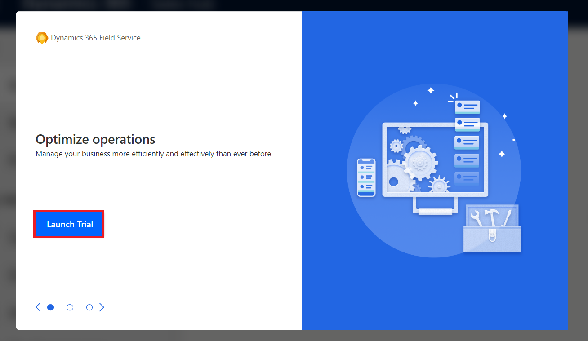

6.  You will be navigated to the **Dynamics 365 Field Service** portal.

> 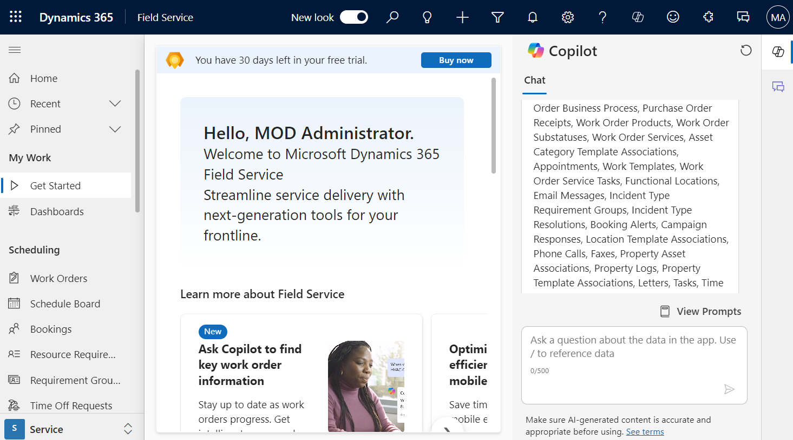

7.  Go to **Power Platform admin center** by navigating to
    <https://admin.powerplatform.microsoft.com> and if required, sign in
    using your given **Office 365 tenant admin** credentials. You can
    see, **Field Service Trial environment** is created.

## Task 2: Install the Field Service Outlook Add-in

1.  Go to **AppSource** **with the given
    link** <https://appsource.microsoft.com/en-us/marketplace/apps?search=dynamics%20365%20field%20service&page=1&product=outlook%3Bteams%3Bsharepoint>
    and select **Dynamics 365 Field Service for Outlook**.

> 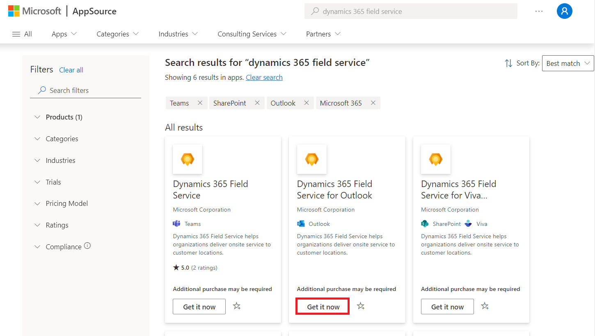

2.  Select **Get it now** and confirm your information.

> 

3.  You will be navigated to **Microsoft Admin center \> Integrated
    Apps**. On the **Assign users** page, select **Entire organization**
    and then select **Next**.

> 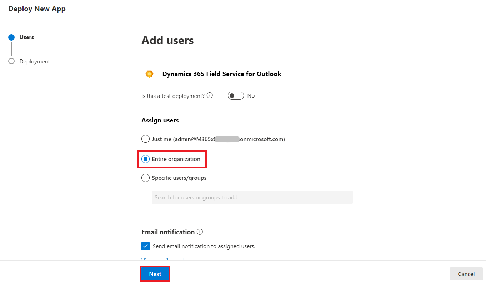

4.  On the **Accept permission requests** page, select **Accept
    permissions**.

> 

5.  Sign in with your **Office 365 admin tenant** credentials on the
    pop-up window.

6.  Select **Next** on the **Accept permission requests** page.

> 

7.  On the **Review and finish deployment** page, select **Finish
    deployment**.

> 

8.  Select **Done** once the deployment is completed.

> 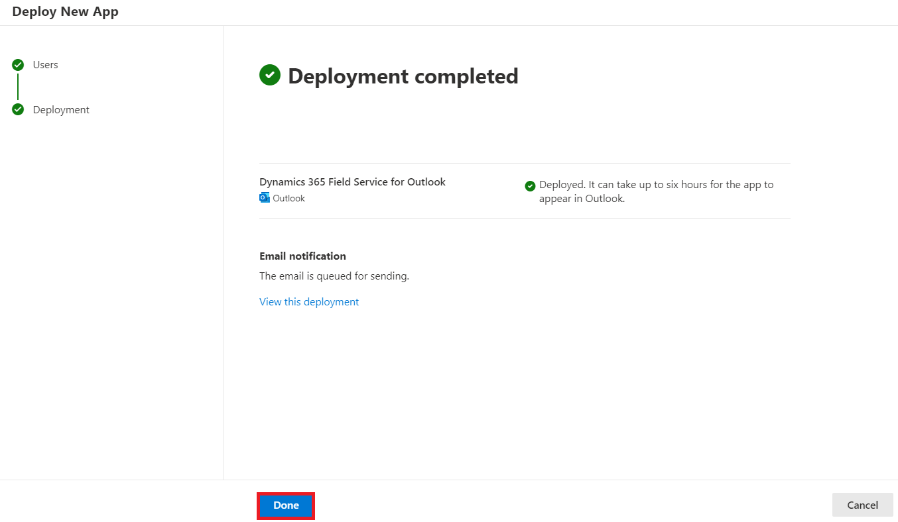

9.  Check the status of **Dynamics 365 Field Service for Outlook** is
    **OK**.

> 

10. It can take up to six hours for the app to appear in Outlook.

# Exercise 5: Get Sales Copilot trial license and install Sales Copilot add-in for Outlook

## Task 1: Sign up for a free Dynamics 365 Sales trial

1.  Go to the **Sales overview** page using the given URL
    <https://www.microsoft.com/en-us/dynamics-365/products/sales> and
    select **Try for free**.

2.  On the **Dynamics 365 free trials** page, select **Dynamics 365
    Sales** and click **Try for free**.

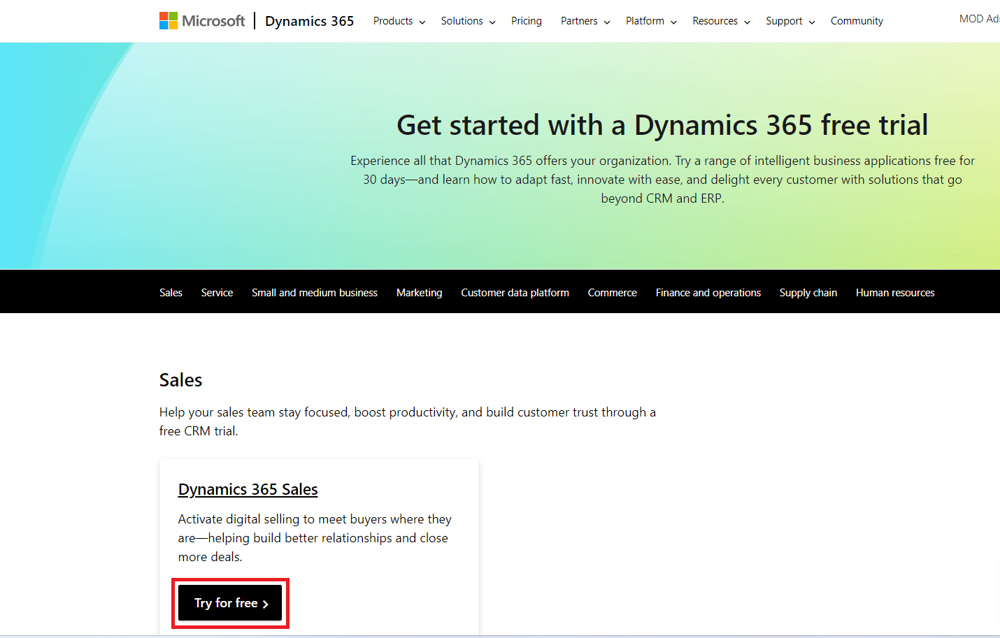

3.  Enter your **Office 365 admin tenant credentials**, select the
    checkbox to **accept the agreement** and click on **Start your free
    trial**.

> 

4.  Provide **Contact Information** as below and then select **Submit**.

> Country/region: **United States**
>
> Phone number: **Your phone number**

5.  If asked, enter your **Office 365 admin tenant password**.

> 

6.  Select **Launch trial** on the pop up window.

> 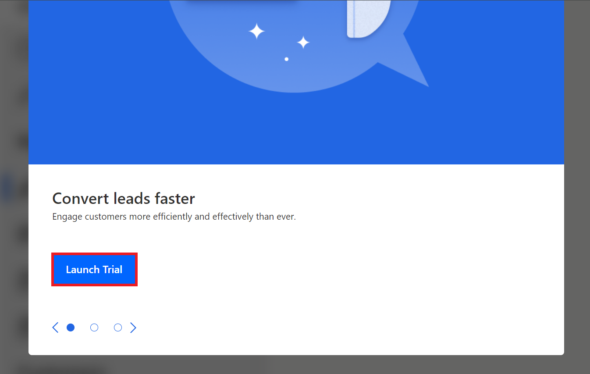

7.  You will be landed to the **Dynamics 365 Sales portal**.

8.  Go to **Power Platform admin center** by navigating to
    <https://admin.powerplatform.microsoft.com> and if required, sign in
    using your given **Office 365 tenant admin** credentials. You can
    see, **Sales Trial environment** is created.

## Task 2: Install Copilot for Sales in Outlook

1.  Sign in to the Microsoft 365 admin center with the given link
    <https://admin.microsoft.com/>.

2.  In the left pane, select **Settings** \> **Integrated apps**.

3.  On the **Integrated apps** page, select **Get apps**. Microsoft
    AppSource opens in an embedded window.

4.  In the **AppSource** window, search for **Copilot for Sales for
    Microsoft Outlook**.

5.  In the search results, select **Copilot for Sales for Microsoft
    Outlook**, and then select **Get it now**.

> 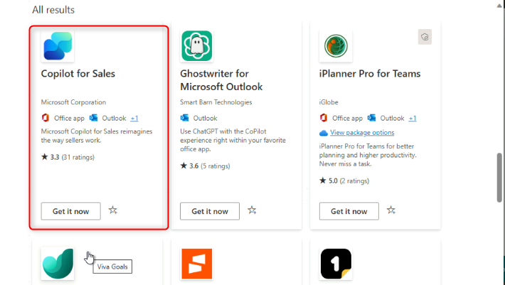

6.  On the **Confirm to continue** page, select **Get it now**.

> 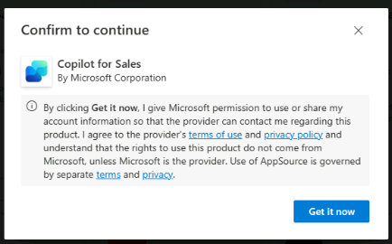

7.  In the **Configuration** step, select **Next** on **Apps to deploy**
    window.

> 

8.  In the** Add Users** step, select **Entire organization** under
    **Assign users**, and then select **Next**.

> 

9.  In the **Deployment (Permissions)** step, read the app permissions
    and capabilities for the app to be deployed, select **Accept
    permissions** for **Copilot for Sales for Microsoft Outlook.** 

> 

10. Sign in with your **Office 365 admin tenant** credentials on the
    pop-up window.

11. Select **Next** on the **Accept permission requests** page.

> 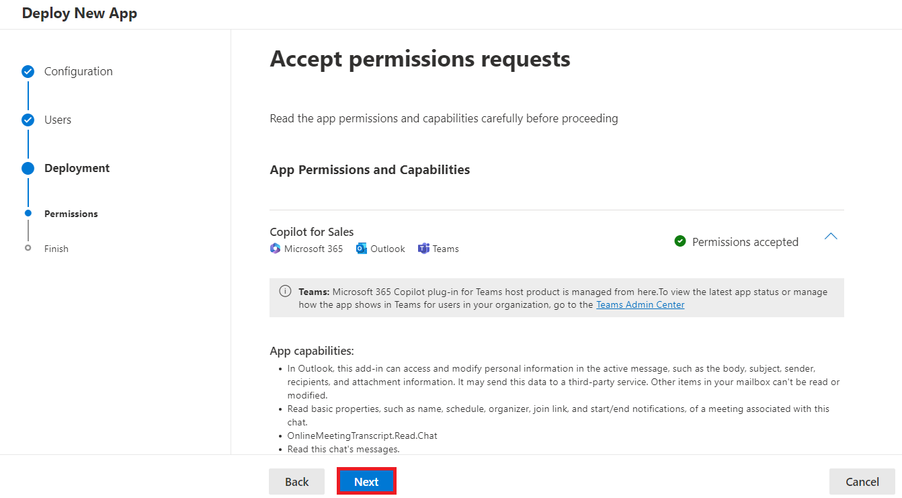

12. In the **Deployment** (**Finish**) step, review the selected
    settings, and then select **Finish deployment**.

> 

13. When the deployment is complete, select **Done**.

> 

Allow up to six hours for Sales Copilot to appear in users' Outlook
ribbon.

# Exercise 6: Sign up for the trial and give consent to use Copilot in Customer Insights – Data

## Task 1: Sign up for the trial

1.  Go to <https://dynamics.microsoft.com/en-us/ai/customer-insights/>
    choose the **Try for free** button.

> 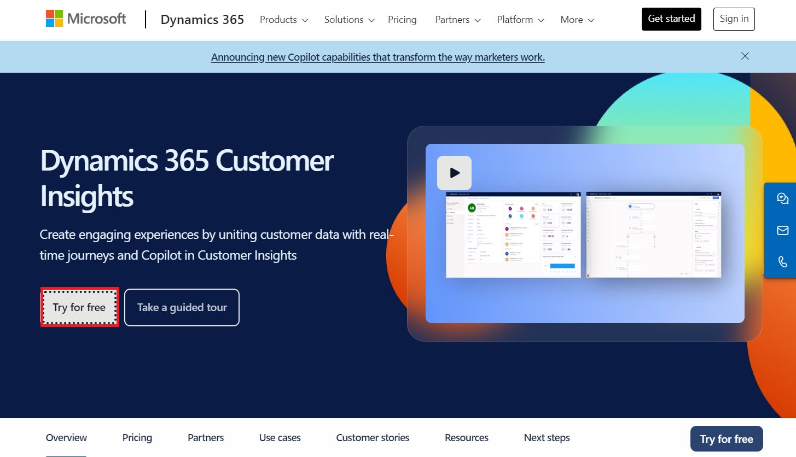

2.  Enter your **Office 365 admin credentials**, check the checkbox to
    **accept the agreement** and click on **Start your free trial**.

> 

3.  Enter your **password** of Office 365 admin tenant.

> 

4.  Select **Yes** on ‘**Stay signed in?**’ window.

> 

5.  Select **United States** as country/region, enter **your phone
    number** and then select **Submit**.

> 

6.  Hjh

> 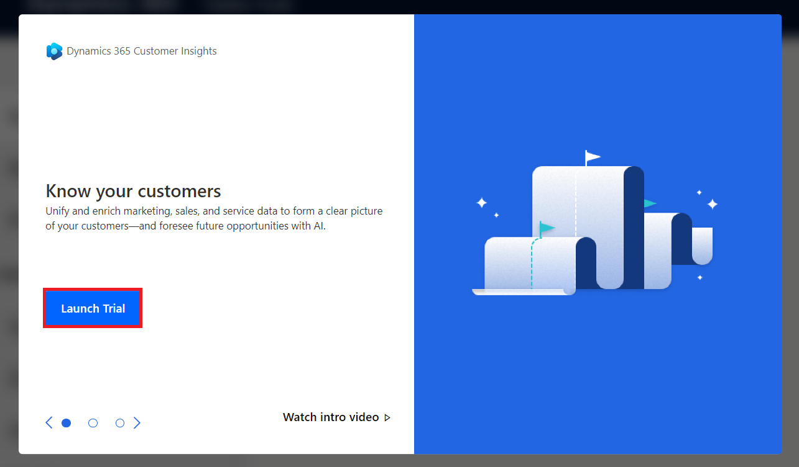

7.  Choose **Start Customer Insights – Data.**

> 

8.  Select **United States** as country/region and then select
    **Continue**.

> 

9.  Select **Start trial** from the top right corner.

> 

10. You can see **Marketing trial** environment is created. You can
    directly execute Task 2. In case, your environment is not created
    and ‘Create an environment for your trial’ page appears then follow
    the below steps.

> 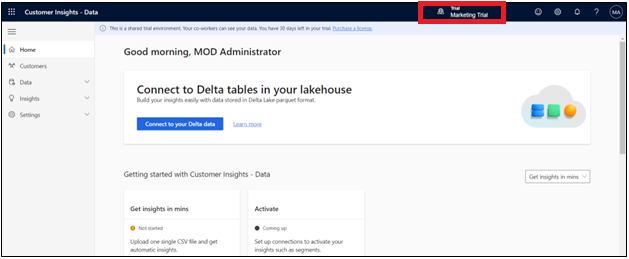

11. On the **Basic information** page, enter **Marketing Trial** in the
    **Name** field, select **United States** for the **Region** field,
    and then select **Next**.

> Note: If you don’t see the Basic information page,

12. Select **Next** on the **Data storage** page.

13. Select your **Dataverse environment** and then click **Next**.

14. Review the information on the **Review** page and then select
    **Create**.

15. It may take some time to create your environment.

16. You can now see that your environment is named as **Marketing
    Trial**.

## Task 2: Give consent to use Copilot in Customer Insights - Data

1.  Go to **Settings** \> **System**.

> 

2.  Select the **Consent** tab.

> 

3.  **Enable** the **Enable Copilot features powered by Azure OpenAI**
    and then select **Save**.

> 
