# Lab 1: Building a canvas app for a real estate solution with Copilot in Power Apps

In this lab, you’ll create a mobile application by using Copilot in
Power Apps. Field agents will use this app to browse real estate
inventory and manage appointments for showings, and the data will be
stored in Dataverse.

**Note:** In this lab, your results for data might vary from those shown
in the screenshots and images. The reason is because Power Apps uses
OpenAI to generate data for the lab and the data changes daily.

1.  Sign into Power Apps <https://make.powerapps.com/> using your Office
    365 tenant credentials.

2.  Ensure that you are in your developer environment - **Dev One**. If
    not, click on the environment selector and select Dev One.

> 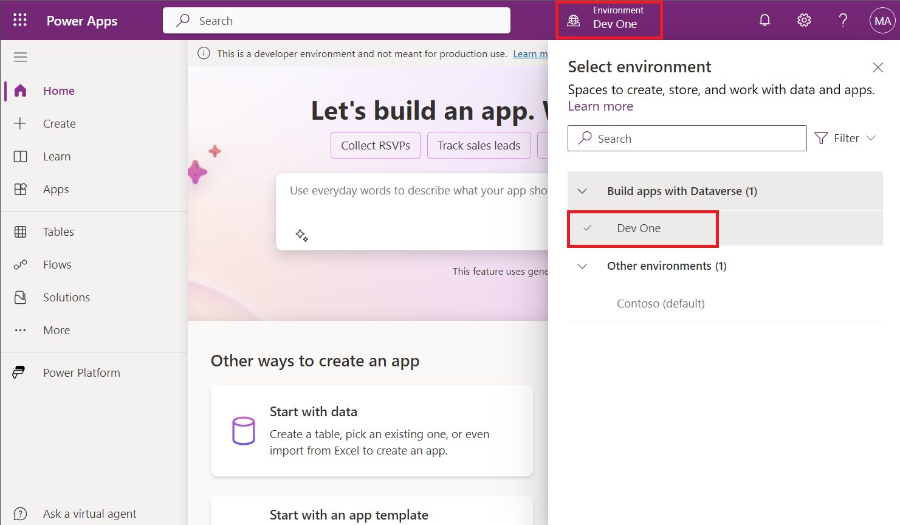

3.  On the Home page in Power Apps, in the center text field, enter the
    following prompt to search for an AI-generated table:

     build an app to manage real estate showings
    
     Select the **Send** button.

> 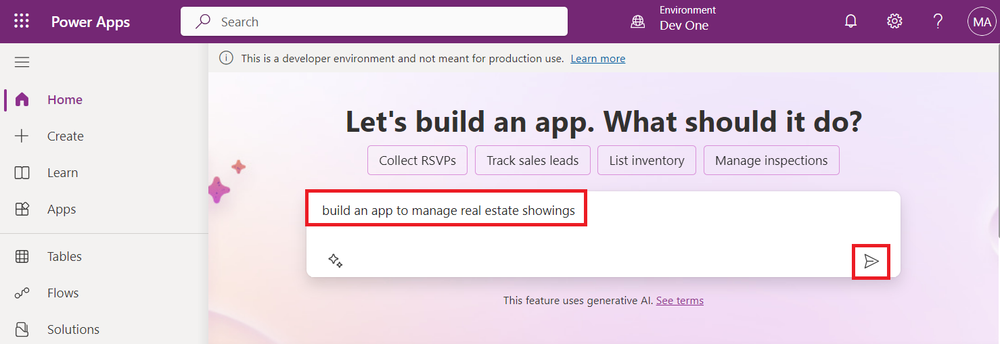

4.  After Copilot AI generates a table based on your prompt, look
    through the table to view the columns that are created for the start
    of your table.

> 

5.  To see more information, click on the arrow above the table.

> 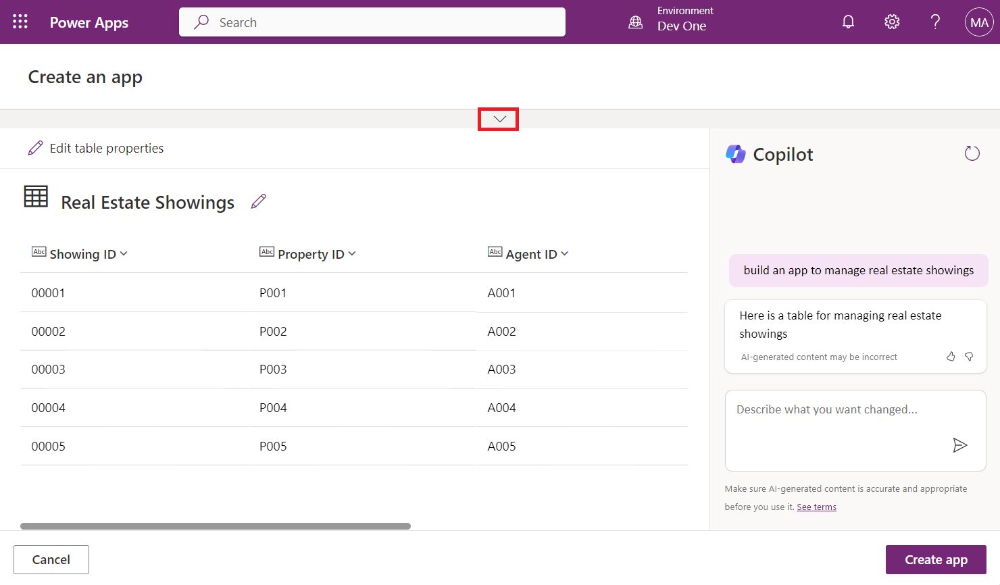
>
> Your next steps are to modify and add to the already generated table.

6.  In the text box, in the lower part of the **Copilot** pane to the
    right of the screen, enter the following text:

> add a column to track client full name
>
> Select the **Send** button.
>
> 

7.  Copilot notifies you that the table is updated, and the new column
    should show as being added to the table. (Move the slide bar towards
    right)

> 

8.  Enter the following text into the chat:

> add a column to track client email
>
> Select the **Send** button.
>
> A new column is added to the table and displays the client’s email.
>
> 
>
> **Note:** The data that's generated in your table might vary from the
> data that's shown in the table in the screenshots for this lab.
>
> **Note:** The **Suggestions** section in the lower-left corner of the
> screen provides you with different suggestions on how you can add to
> and modify your table.
>
> 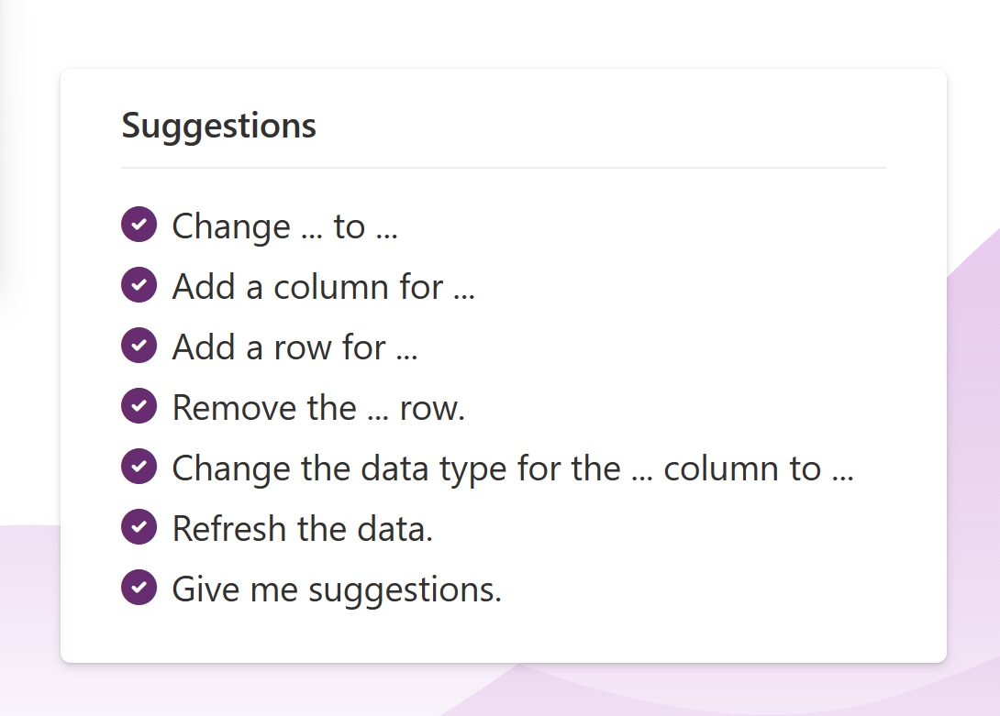
>
> On the right of the screen, it appears as if you're having a
> conversation with a Copilot AI bot while adding to and modifying your
> table. This area is where you can scroll through and view the changes
> or additions that you've made to your table.
>
> 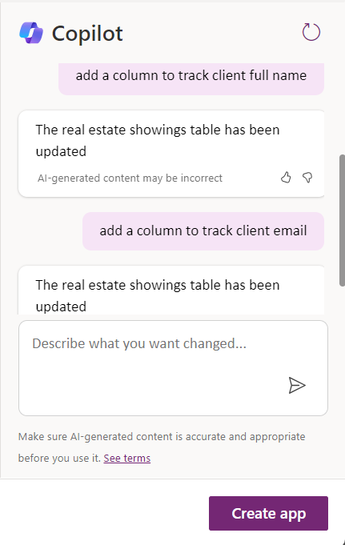

9.  Enter the following text into the chat:

> Add columns to track client address and agent name
>
> Select the **Send** button.
>
> A new column is added to the table and displays the client’s email.
>
> 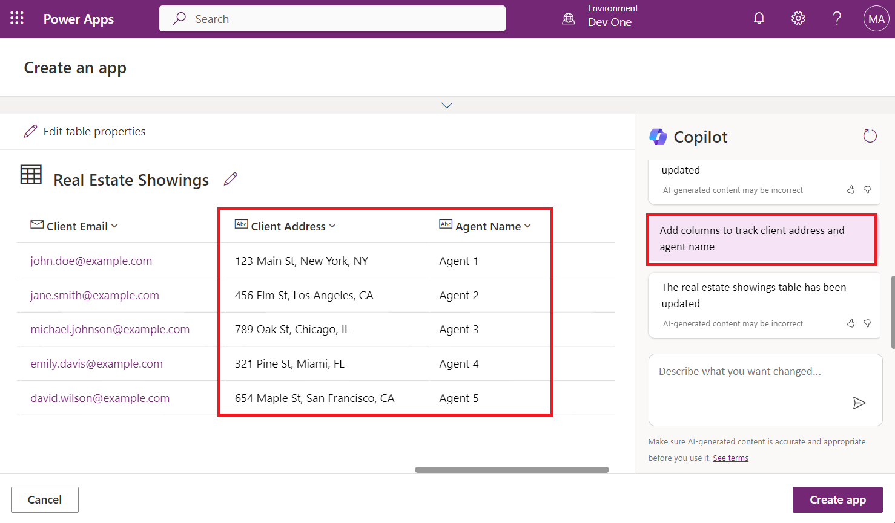

10. Edit the **Status** column within the table. In the text box within
    the **Copilot** pane, enter the following text and then send it:

> add an option for “Completed” to the Status column
>
> The system might take a minute to load. When it does,
> the **Status** column shows as updated and includes the option
> for **Completed**.
>
> 

11. Select the **Status** column name dropdown menu and then
    select **View column.**

>  

12. You can view the columns’ properties and the current status details
    and data.

> 

13. If your column choices aren't the Pending, Confirmed, Cancelled and
    Completed then enter the following command into the **Copilot** pane
    text box and then send it:

> the status choices should be Pending, Confirmed, Cancelled, and
> Completed
>
> 

14. You can see the new choices are now added. Select the **X** in the
    upper-right corner of the pane to close it.

> 

15. To add more data to your table and the existing columns. In
    the **Copilot** pane text box, enter and send the following text:

> add 5 more rows of data
>
> Five more rows of data are added for each existing column in the
> table.
>
> 
>
> Your table should have several columns. However, to continue following
> the modules in this learning path, try to remove some columns that you
> won't use.
>
> The list of columns that you need are:

- ID

&nbsp;

- Address

&nbsp;

- Date

&nbsp;

- Status

&nbsp;

- Agent Name

&nbsp;

- Client Full Name

&nbsp;

- Client Email

> Use what you've learned with the **Copilot Chat** window to adjust
> your table to match the preceding list. Make sure that you refer to
> the **Suggestions** section if you need to remove a column, change a
> column name, or add a column.

16. To create the app, select the **Create app** button in the
    lower-right corner of the screen.

> 

17. When the app first loads, a dialog might appear stating **Welcome to
    Power Apps Studio**. If so, select the **Skip** button.

> 

18. The app that has been built for you should show in **Edit** mode.

> 

19. For the better view, close the Copliot pane.

> 

20. Select the **Data** icon from the left navigation bar. Copilot has
    created a **Dataverse** table that's now displaying in
    the **Environments** section.

> 
>
> **Note:** Currently, Copilot is only supported for Dataverse. You
> can't use any other data access point at this time.
>
> Next, you'll edit the table now that the app has been created.

21. Within the **Data** pane, hover your mouse cursor over the table. To
    the right of the table, select the ellipsis (**...**) and from the
    menu, select **Edit data**.

> 
>
> **Note**: In the **Edit table** dialog, you can add your own columns
> to the table or modify existing columns.

22. Select the Showing ID column header from the table. From the
    dropdown menu, select the **Edit column** option.

> 

23. In this example, you don't want the **Data type** to be a **Single
    line of text**. To change that value, go to the **Edit
    column** pane, and then from the **Date type** dropdown menu,
    select **\# Autonumber**. Select **Save**.

> 

24. Select the **Close** button in the lower-right corner of the **Edit
    table** dialog.

> 

25. The table should now show as **Refreshed** in the **Data** pane.

> 

26. Modify the gallery in the application so that it displays the
    relevant data. Select the **Tree view** icon to return to the Tree
    view.

> 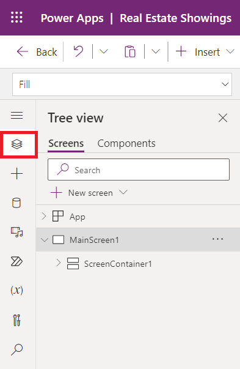

27. On the app's main screen, select **RecordsGallery1** to
    display **Real Estate Showings** (To select RecordsGallery1, select
    MainScreen1 \> ScreenContainer1 \> BodyContainer1\>
    SidebarContainer1 \> RecordsGallery1).

> 

28. Now select the **edit button** of the **RecordsGallery1** to put the
    gallery in edit mode.

> 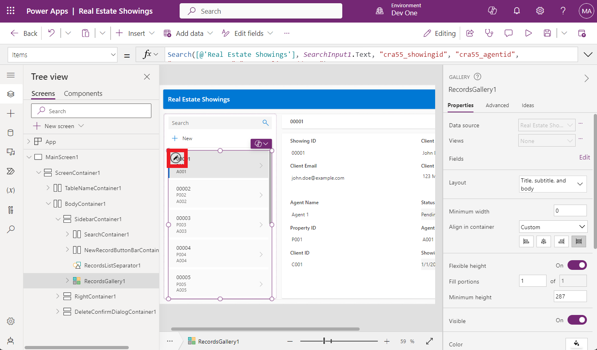

29. Select the **Title** and then set the **Text** value to the
    following formula:

> ThisItem.'Client Address'
>
> 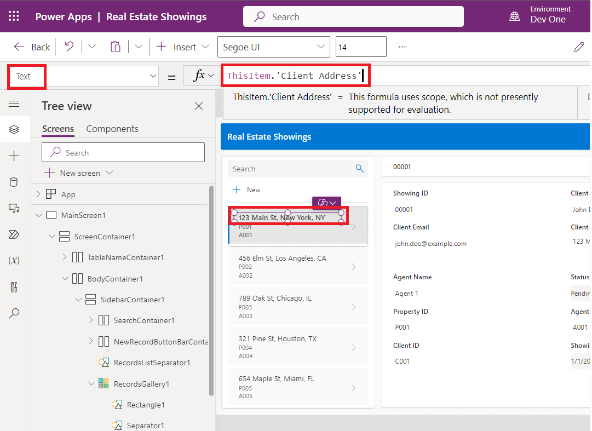

30. Select the **Subtitle** and then set the **Text** value to the
    following formula:

> ThisItem.'Client Email'
>
> 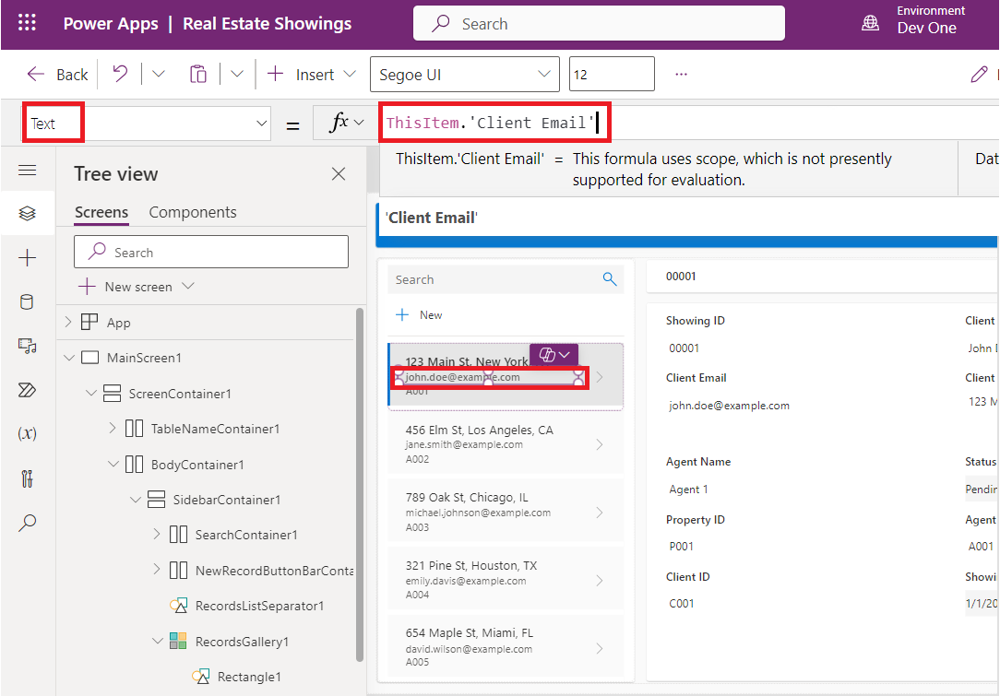

31. Select the **Body** and then set the **Text** value to the following
    formula:

> ThisItem.Status and then from the suggestions select,
>
> ThisItem.'Status (cra55_status)'
>
> **Note:** In the above formula, cra55 value can be different in your
> case
>
> 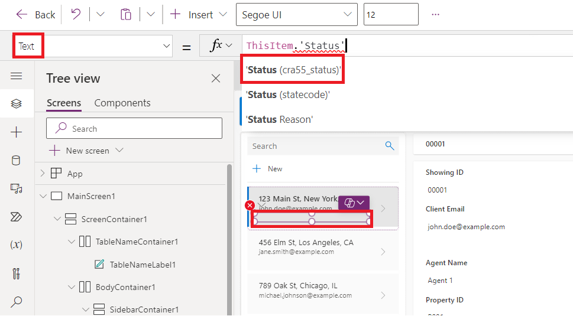
>
> A single record in the gallery should now resemble the following
> image.
>
> 

32. On the app's main screen, select the **Form** control.

> 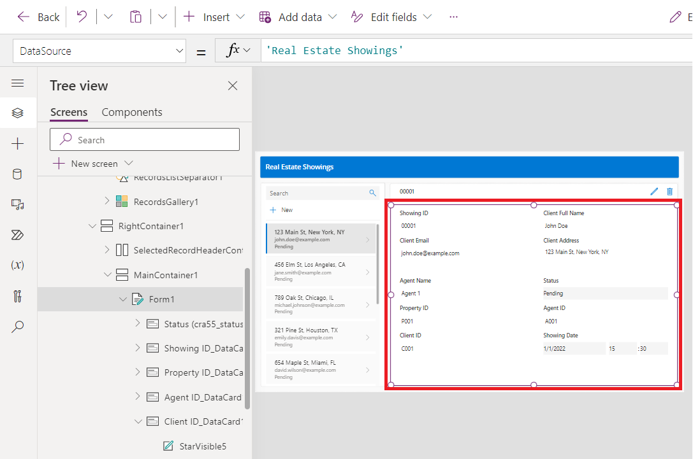

33. On the **Properties** pane on the right, under
    the **Fields** property, select **Edit fields**.

> 

34. In the **Fields** pane, expand the Showing ID field. From
    the **Control type** dropdown menu, change the type to **View
    text**.

> 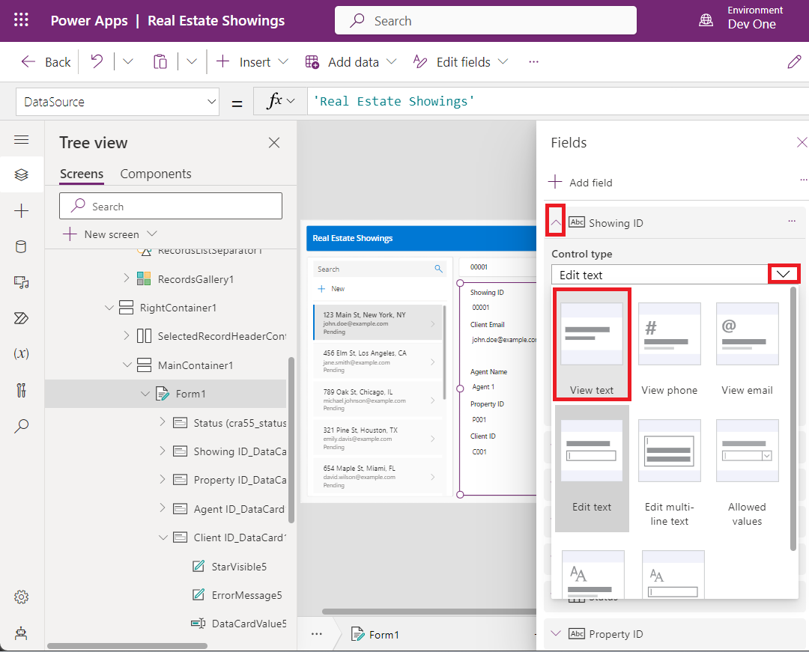
>
> Because you previously changed the **ID** field to **Autonumber**, you
> don’t want users entering their own number; Dataverse automatically
> enters the numbers for you.

35. In the **Fields** pane, select the **X** in the upper-right corner
    to close the pane.

> 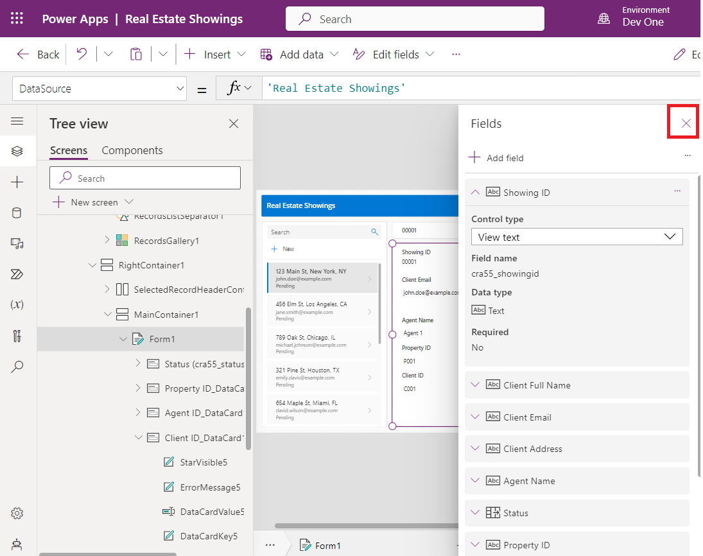

36. Make a new request for a property that shows in the app by selecting
    the **Play** button from the upper part of the screen.

> 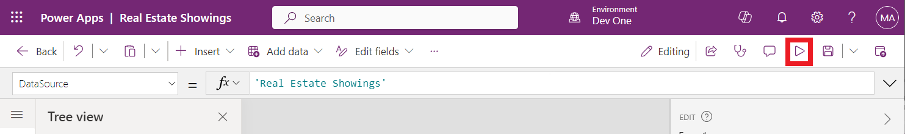

37. In the left pane, select the **+New** button.

> 

38. Though you could modify the form to automatically fill in the fields
    for you, for this lab, you'll complete this step manually to observe
    how the app works.

> Fill in the fields with the following information:

- Client Full Name - \< Your name \>

&nbsp;

- Client Email - \< Your email \>

&nbsp;

- Client Address - 210 Pine Road, Portland, OR 97204

&nbsp;

- Agent Name - \< Your name \>

&nbsp;

- Status - Pending

&nbsp;

- Property ID: P011

- Agent ID: A011

- Client ID: C011

&nbsp;

- Date - \< Any future date \>

&nbsp;

- Time - \< Any future time \>

> ** **
>
> 

39. Select the check mark in the upper-right corner of the screen.

> 

40. Select the **X** in the upper-right corner to close out of the app.

> 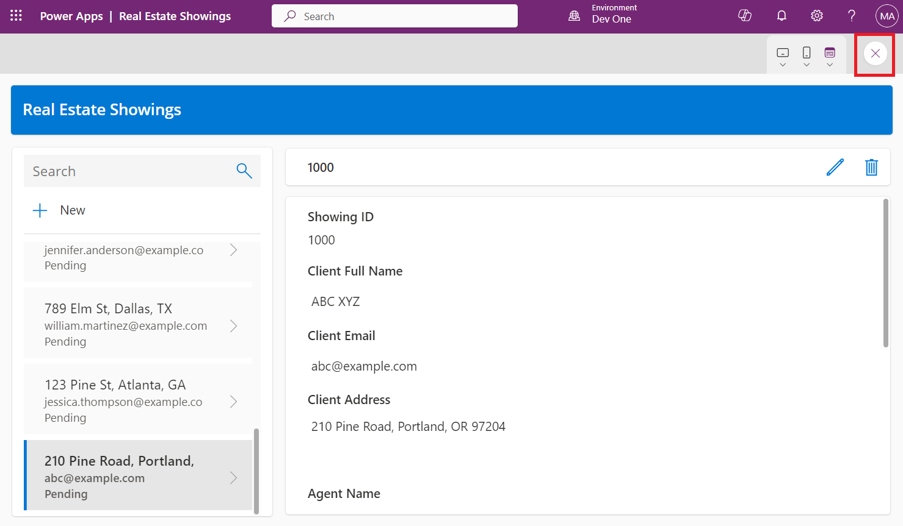
>
> If a dialog appears saying **Did you know?**, select **OK**.
>
> 
>
> The new request is added to the left of the list of requests.

41. From the upper part of your screen, select the **Save** button to
    save the new app that you created.

> If the system prompts you, save the app name as **Real Estate
> Showings**.
>
> 

42. Exit the app to return to the Power Apps home page.
