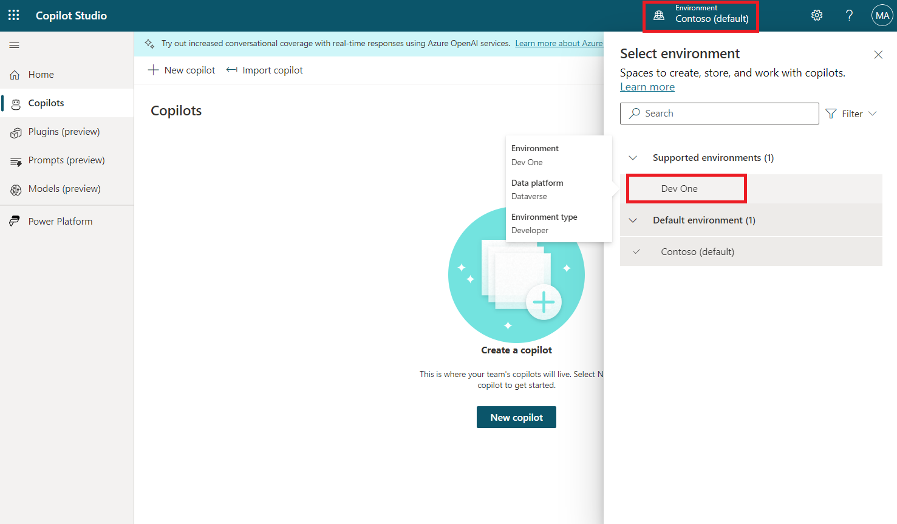

**Lab 3 - Building a bot in Microsoft Copilot Studio with the new AI
capabilities**

In this lab, you'll create a bot by using Copilot in Microsoft Copilot
Studio. Additionally, you'll learn how to use the Conversation Booster
feature to improve your bot's responses.

1.  Sign into Microsoft Copilot Studio using
    <https://powerva.microsoft.com/> with your Office 365 tenant
    credentials.

2.  Select **United States** as your country/region and then
    select **Start free trial**/**Get started**.

> 

3.  Select **Dev One** environment from environment selector.

> 

4.  On the **Welcome to Copilot Studio** pop-up, select **Skip**.

> 

5.  Select **+Create** from the left navigation menu and then
    select **New copilot**.

> 
>
> The Create a bot wizard opens. This wizard helps you set up your bot
> by naming it, selecting the language, and also optionally choosing if
> you want to boost your conversations with generative answers.

6.  Select **Skip to configure**.

> 

7.  Name your bot as **Real Estate Booking Service** and then click on
    **+Add knowledge**.

> 

8.  Select **Public website**.

> 

9.  Under the webpage link, enter the
    **https://powerplatform.microsoft.com/** and then select **Add**.

> 

10. You can see the link added under Webpage link field, now again
    select **Add**.

> 

11. Select **Create**.

> 

12. With your bot created, select **Topics** from the left navigation
    menu and then select the **+ Add atopic** dropdown menu.
    Select **Create from description with Copilot**.

> 
>
> **Note:** If the **Create with Copilot** option doesn't display, you
> might need to enable Intelligent authoring support:

1.  Select the **Settings** icon in the upper menu and then
    select **General settings**.

&nbsp;

1.  Set the **Intelligent authoring support with Copilot** toggle
    to **On**.

&nbsp;

13. A new window appears asking you to **Name your topic** and provide a
    description in the **Create a topic to...** space.

14. In the **Name your topic** field, enter the following text:

> Book a Real Estate Showing

15. In the **Create a topic to...** field, enter the following text:

> collect a user's full name, email, address of the property, and date
> and time of the showing
>
> Select **Create**.
>
> 
>
> A new topic displays with the generated trigger phrases.
>
> 
>
> **Note:** Remember, your generated content might appear differently
> than what's shown in this lab.
>
> Multiple question nodes, entity selection, and variable naming should
> also display.
>
> 

16. Look for and then select the **What is your email
    address?** question node.

> 

17. Select the **Edit with Copilot** icon in the upper part of the
    authoring canvas.

> 

18. In the **Edit with Copilot** panel, in the **What do you want to
    do?** field, enter the following text:

> In the ‘What is your email address’ question node, update the message
> to say thank you to the FullName variable from the previous node and
> then proceed to ask the question
>
> Select **Update**.
>
> 
>
> The message should be updated to include the *Name* variable from the
> message node before it.
>
> 
>
> In addition to adding new nodes, you can use Copilot to update
> existing ones.

19. In the **What do you want to do?** field, enter the following text:

> add a question to confirm if user wants to visit again with the option
> to select either "Yes" or "No"
>
> add a question to confirm if the user wants to visit again with the
> option to select either "Yes" or "No"
>
> Select **Update**.
>
> 

20. Select **Save** to save your changes.

> 

21. On the right side of the screen, you can see the Test your copilot
    pane is already opened.

> 

22. When the **Conversation Start** message appears, your bot will start
    a conversation. In response, enter a trigger phrase for the topic
    that you've created:

> I want to book a real estate showing
>
> The bot responds with the "What is your full name?" question, as shown
> in the following image.
>
> 

23. Enter the rest of the information:

> Copy
>
> Full name: \<Your name\>
>
> Email address: \<Your email address\>
>
> Address: 555 Oak Lane, Denver, CO 80203
>
> Date and Time: 10/10/2023 10:00 AM
>
> 

24. Select Yes or No.

> 

25. To test the boosted bot, enter What is Microsoft Power Platform? The
    bot retrieves information from the website which we have provided
    while creating a bot and returns a response.

> 
