# Lab 5: Creating an AI-generated site, webpage using Copilot (preview) and adding other components to pages

**Exercise 1: Create a site with the help of AI**

To use Copilot for site creation:

1.  Go to Power Pages using <https://make.powerpages.microsoft.com/>

2.  Ensure that, you are in Developer environment – **Dev One** and then
    click on **Get started**.

> 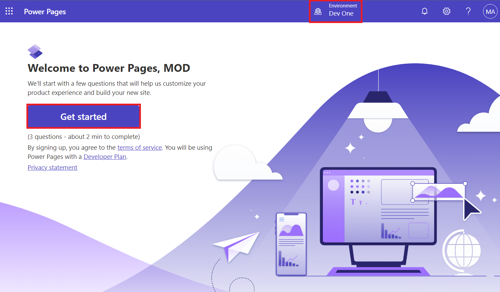

3.  Select **Skip** on **Tell us about yourself** window.

> 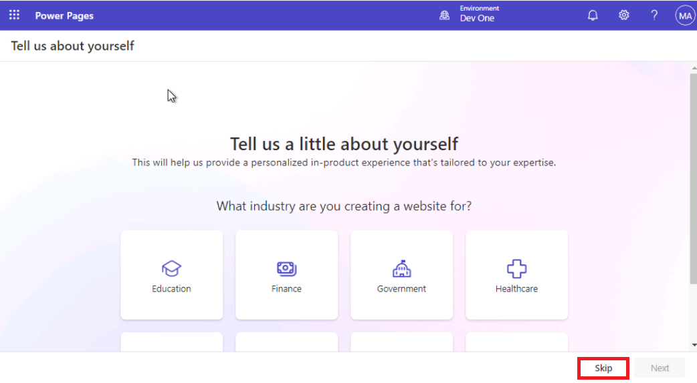

4.  On Create a site page, enter the given statement to describe the
    site, you want copilot to build and then click on generate icon.

> **Build a website for public transportation for residents of city, to
> view routes and fares.**
>
> 

5.  Copilot generates a site name and a web address based on your
    description. Edit these suggestions as needed for your site, and
    select **Next**.

> 

6.  Copilot generates a home page layout, which you can scroll through
    and browse the page generated. Select **Next** to accept the
    suggested layout.

> **Note**: Before selecting Next, you can select Try again to generate
> a new layout.
>
> 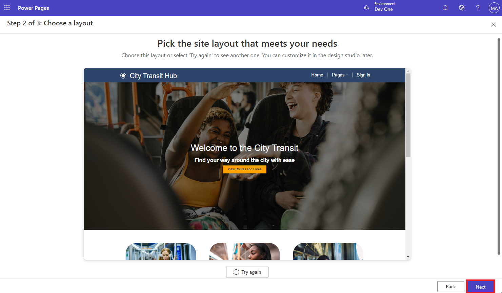

7.  Copilot generates more pages that could be used in the site based on
    the description. Select one or more pages (Eg. About Us, Routes,
    Fares and Contact Us )and select **Done** to complete the site
    creation.

> 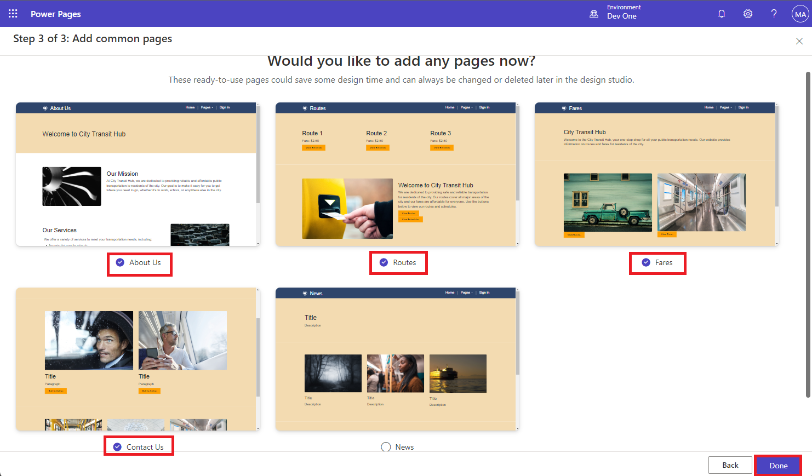

8.  You can see, your site is setting up.

> 

9.  Close the pop-up that gives information to edit the page.

> 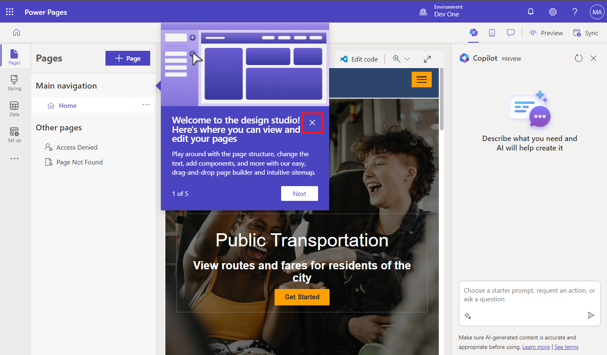

10. You can now see your newly created site with few added webpages.

> 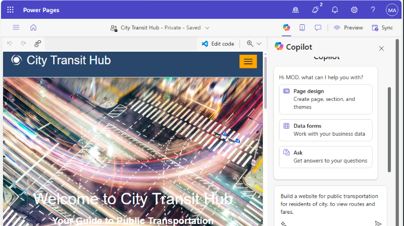

## Exercise 2: Create an AI-generated webpage using Copilot (preview)

### Task 1: Generate a webpage

To use Copilot to generate a webpage:

1.  Considering that you are on the home page of your newly created
    website.

2.  Initially you will be on the **Pages** workspace.

> 

3.  Select the **Copilot** button in the command bar, if the Copilot
    panel is not open already.

    - Type a description of your webpage in the **Choose a starter
      prompt, request an action, or ask a question** text field.

> Sample descriptions:

- Create a Thank you for visiting our site webpage

> 
>
> After the page is generated, it's added to the main navigation, and
> you can review the page and the content. Sections, text, and images in
> the page are low-code editable using the WYSIWYG editor.
>
> 

4.  To complete page review, select **Keep it**.

> 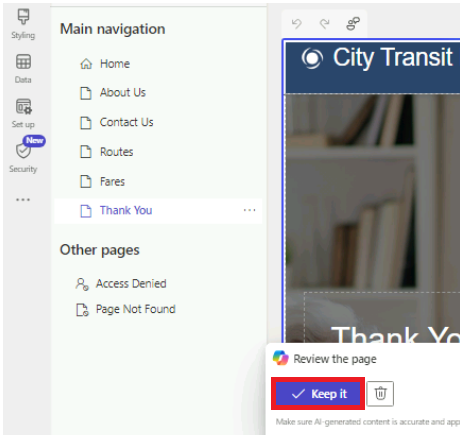

## Exercise 3: Add an AI-generated form using Copilot (preview)

### Task 1: Create a form with Copilot

1.  Go to the **Pages workspace** and select a **Routes** page for your
    form.

> 

2.  Hover the mouse over first section of the Routes webpage and then
    click on **+ Add a section** \> **1Column**.

> 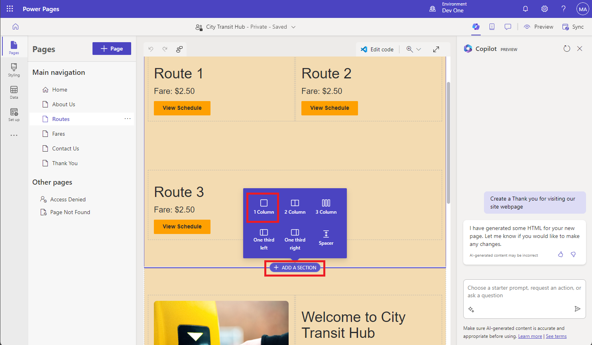

3.  Select **More** and then select **Form** component.

> 

4.  In the text box under **Describe a form to create it**, describe
    your form. You can use up to 250 characters in your description. To
    send your description to Copilot, press the Enter key or select the
    paper airplane icon in the lower-right corner of the text box.

> **Example**: Create a form for collecting suggestions and
> addition/deletion of the routes
>
> 
>
> **Note:** You can check the preview to the right of your description
> and refine the form as needed.

- To change the form, select a quick action or refine your description.

&nbsp;

- The history shows you the descriptions you've entered so far.

&nbsp;

- Select **Start over** to erase everything and start with a new
  description.

> 

5.  To add the form to the page, select **OK**.

> 

### Task 2: Add an AI-generated multistep form using Copilot (preview)

To use Copilot to generate a multistep form:

1.  Go to the **Pages workspace** and choose a Thank you page for your
    form.

> 

2.  Select the **Copilot** button from the command bar.

> 

3.  Type a description of your form in the copilot text box. For
    example, create a multistep form for getting information of a
    specific route and the fare.

> 
>
> After the form is generated, a preview of the form displays on the
> canvas, and the **Review this form** toolbar displays at the bottom of
> the canvas.
>
> Review each step. Then decide if you want to keep the form or discard
> it. If you choose to add the form to the page, you can edit it using
> design studio's existing functionality just as you would for other
> components.

### Task 3: Generate text with Copilot

1.  Go to the **Pages workspace** and select **About Us** page for your
    form.

> 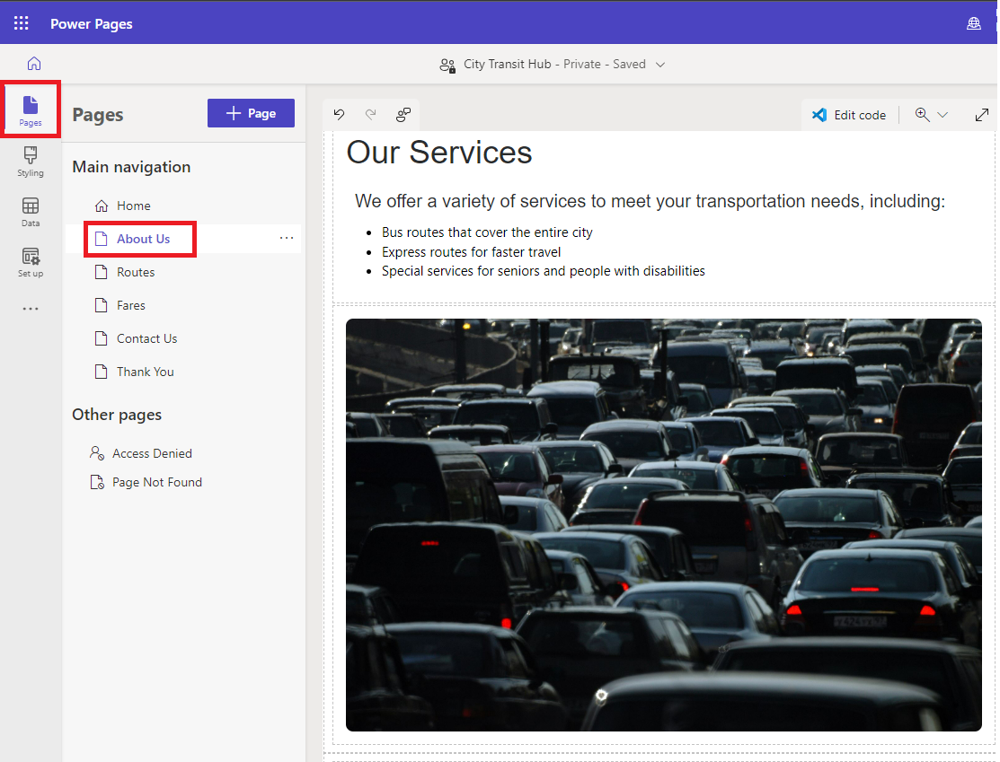

2.  Hover the mouse over the page and select **+Add a section** \>
    **1Column** under Our Services section.

> 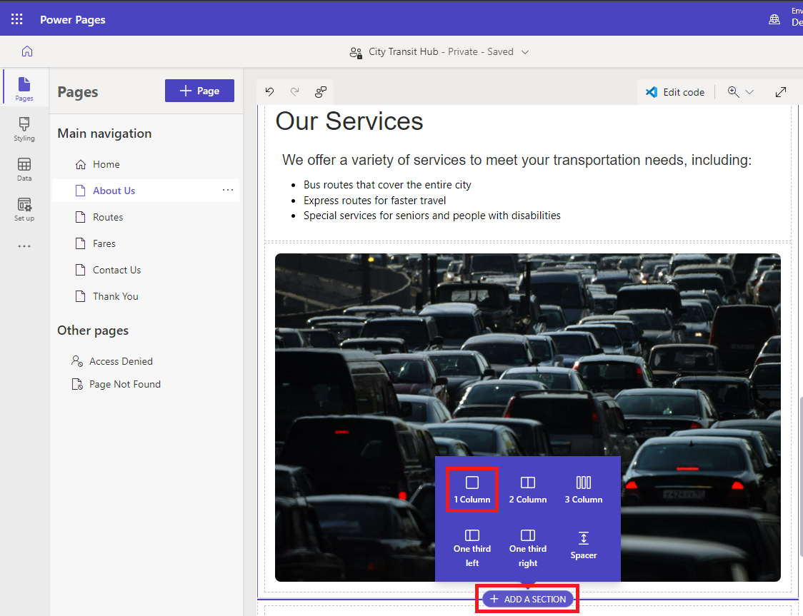

3.  Select the **Text** component.

> 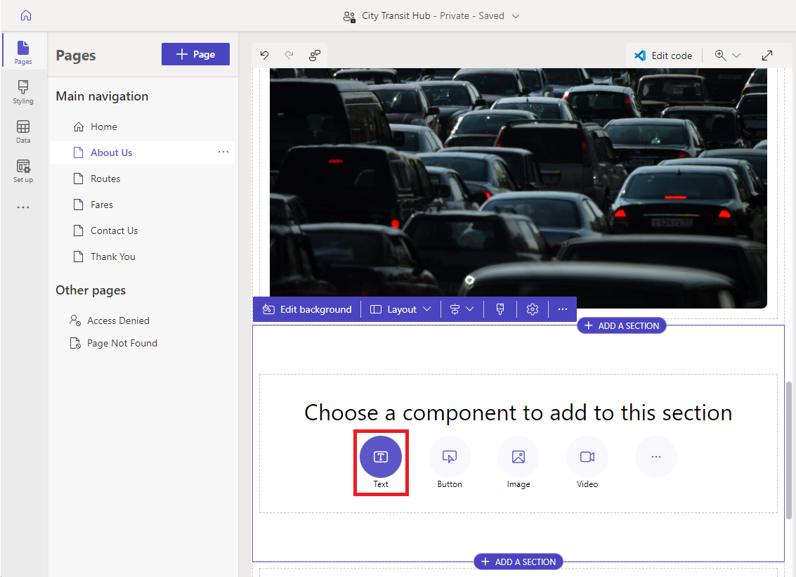

4.  In the text component toolbar, select the **Copilot** icon.

> 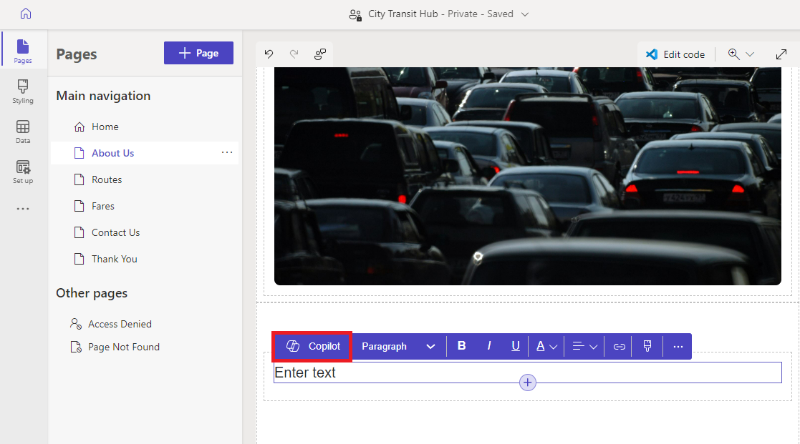

5.  Describe the text that you want to Copilot to generate; for example,
    " I want to describe importance of local transport". You can use up
    to 1,500 characters in your description. To send your description to
    Copilot, press the Enter key or select the paper airplane icon in
    the lower-right corner of the text box.

> 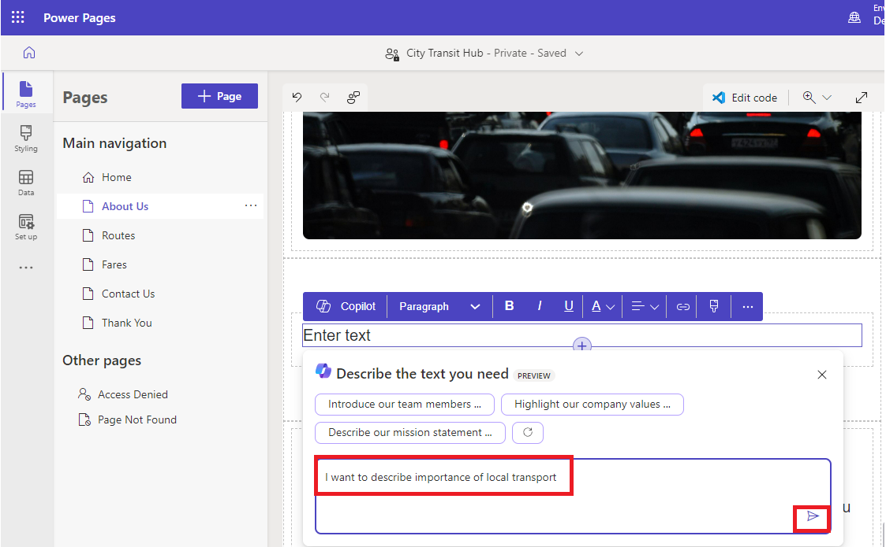

6.  Check the preview below your description and refine the text as
    needed.

    - To refine your description and generate new text,
      select **Rewrite**.

    &nbsp;

    - To keep the generated text but make it sound more friendly,
      casual, educational, professional, or excited, select **Change the
      tone**.

    &nbsp;

    - To keep the generated text but make it more concise or expand on
      it, select **Adjust the length**.

    &nbsp;

    - To give Copilot more information, select **Add more details for
      Copilot to work with**.

    &nbsp;

    - To give Microsoft feedback on how well Copilot interpreted your
      description or refinement, select the thumbs-up or thumbs-down
      icon.

7.  To add the text to the page, select **Add to page**.

> 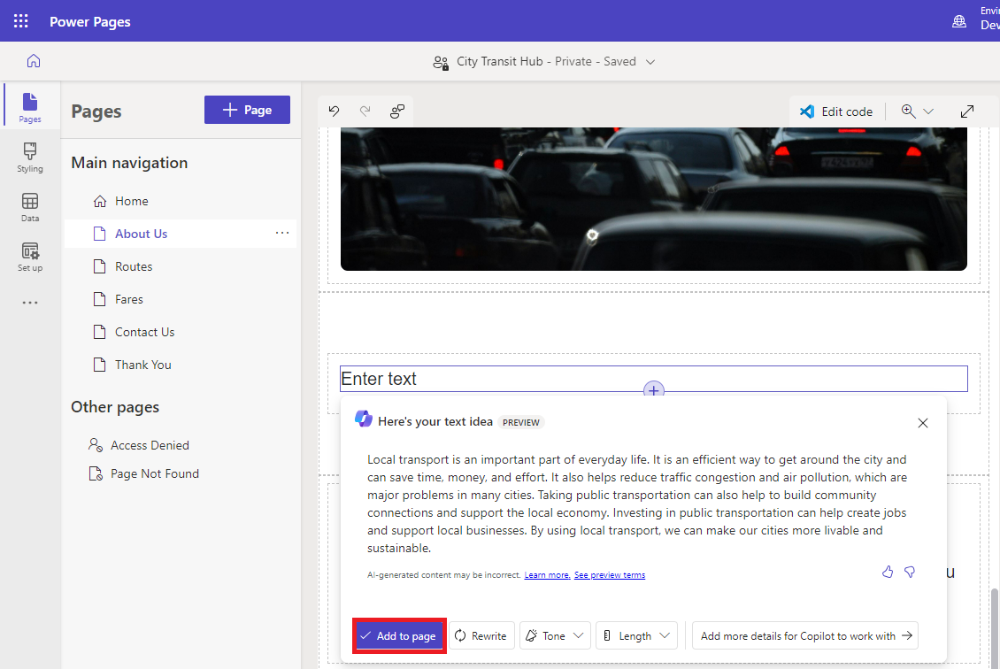

### Task 4: Testing your site

1.  Select **Preview**, followed by **Desktop**. If asked sign in with
    admin credentials and check the **checkbox of the consent** and
    select **Accept**.

> 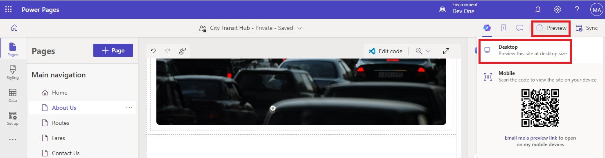

2.  You can see the home page and the list of other webpages.

> 

3.  Select Router page. You can observe the AI-generated form.

> 

4.  Fill up the few fields of the form and then select **Submit** button
    at the end of the form.

> 

5.  Check the **checkbox of the consent** and select **Accept**.

> 

6.  Once you've successfully submitted the form, return to the design
    studio.

> **Note**: Try one more time if you don’t get message of successful
> submission.
>
> 

7.  Select **Data**, then select the **Copilot Suggestion Routes** table
    (table name can differ) and confirm that you can see that records
    were created using the multistep form process.

> 
