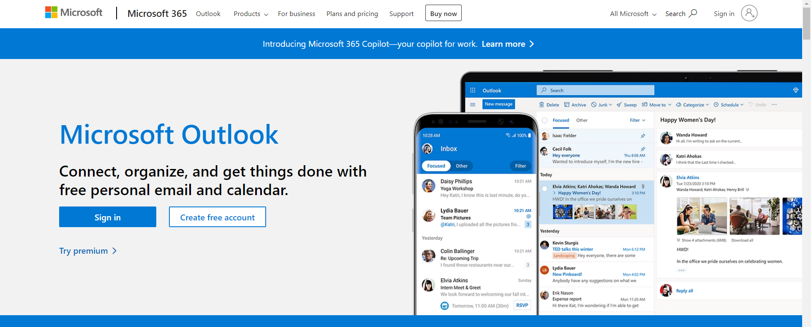
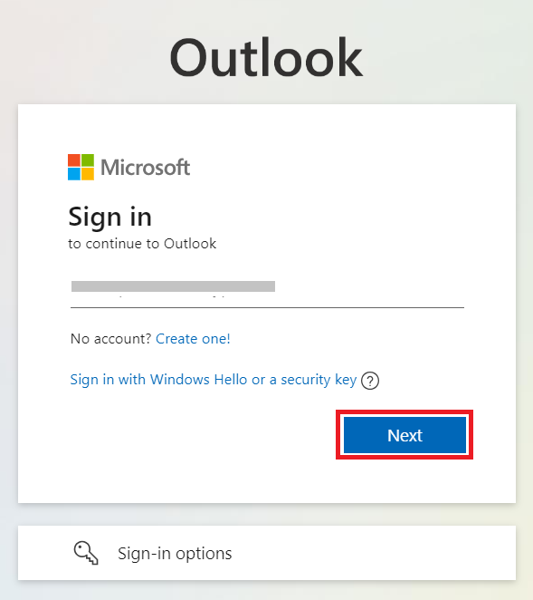
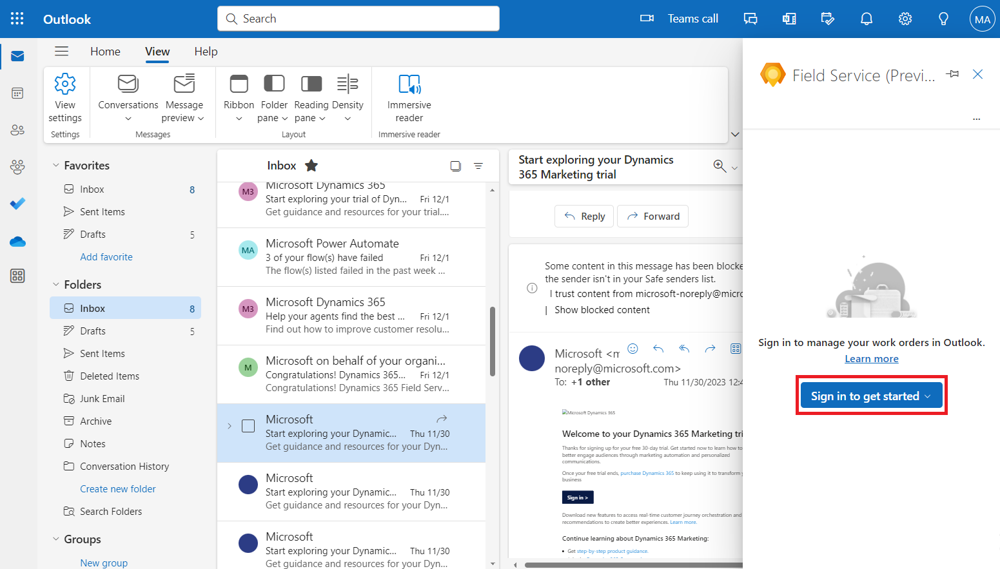
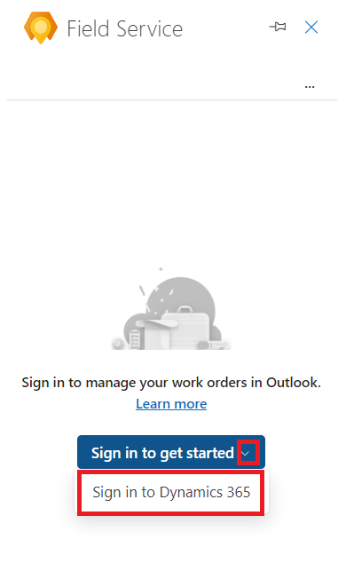
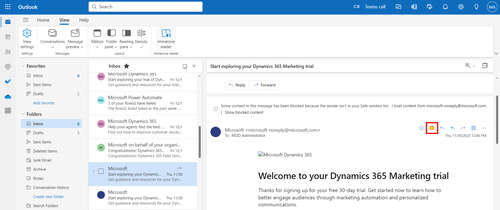
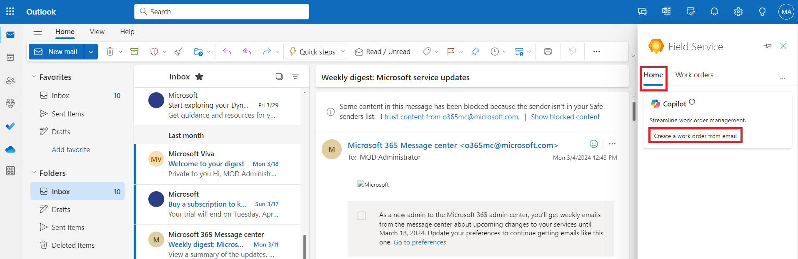
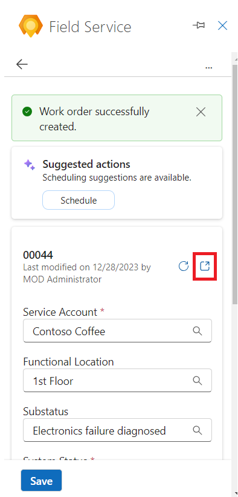
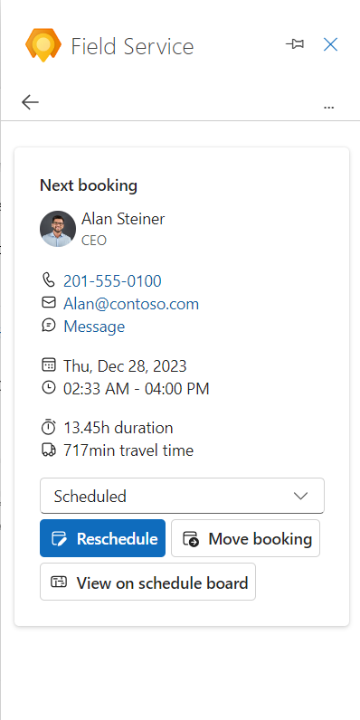

# **Lab 8: Creating and deploying an agent-facing copilot using Microsoft Copilot for Service**

### **Task 1: Create an Agent copilot**

You can create an Agent copilot in a few easy steps.

1.  Go to the sign-up page
    using <https://go.microsoft.com/fwlink/?linkid=2252259>.

2.  Select **Continue**.

> 

3.  Select United States as Country/region, enter your phone number and
    select **Get started.**

> 

4.  Select **Get started**.

> 

5.  From the environment selector, select **Dev One** environment and
    then click on Create a **Copilot for agents**.

> 

6.  Continue with the pre-defined name and then select **Next**.

> 

7.  Under **Choose a customer engagement service**, select **I don’t
    want to set this up right now** and then select **Create**.

> 

8.  Navigate to the **Content sources** page.

> 

9.  Under **Websites**, paste the given website -
    <https://www.microsoft.com/en-in/power-platform> and then select
    **Add**.

> 

10. Select **Save** at the top.

> 

11. In the **Test Copilot** section, type **What is Power Platform**.
    And select **Send** icon.

> 

12. You can see the response given by Copilot.

> 

### **Task 2: Publish in Copilot for Service**

1.  Navigate to the main **Overview** page of Copilot for Service.

> 

2.  In the **Publish your copilot** card on the **Overview** page,
    select **Publish**.

> 

It may take a few minutes for the copilot to publish. Once published
successfully, the status indicator shows the *last published* timestamp.

### **Task 3: Connect your bot to the Microsoft Teams channel**

1.  In the **Access you copilot** card, select **Connect to Teams.**

> 

2.  If asked, sign in with your **Mod Admin** credentials.

3.  On **Microsoft Copilot Studio** portal, navigate to **Channel,**
    select **Turn on Teams**

> 
>
> 
>
> **Note:** If you do not see this option, then the Microsoft Teams
> channel may already be enabled.

4.  Select **Edit details** to change the bot's icon, color, and
    descriptions. These will be shown in the Microsoft Teams app store
    and the app's About tab after the user installs the bot.

> 

5.  Change the short description to **Test bot** then select **Save**.

> 

6.  Select **Open bot** to have the installation prompt launch in
    Microsoft Teams.

> 

7.  Select **Cancel** on **Open Microsoft Teams (work or school)?**
    Pop-up window.

> 

8.  Select **Use the web app instead**.

> 

9.  Select **Add** to have it added as an app in Teams. This only
    installs the bot for you.

> 

10. Enter **What is Power Platform** in the **Type a message** box and
    click on **send icon**.

> 

13. You can see the given response from Agent copilot.

> 
