# Lab 9 – Composing emails, viewing email summary and opportunity summary in Outlook using Copilot for Sales

## Exercise 1: Open the Copilot for Sales 

1.  In a new tab open **Outlook** using the link
    [www.outlook.com](http://www.outlook.com).

2.  Sign in with your **Office 365 admin tenant** credentials.

3.  Open any of the emails. While in an email, select the **Apps** icon.

4.  If you can see **Copilot for Sales** under **Apps,** you can
    directly execute step 12.

5.  If you don’t see **Copilot for Sales** under **Apps**, select **More
    apps**, and then click **Add apps**.

6.  On the **Apps** page, search for **Copilot for Sales** and then
    select **Copilot for Sales** app.

> 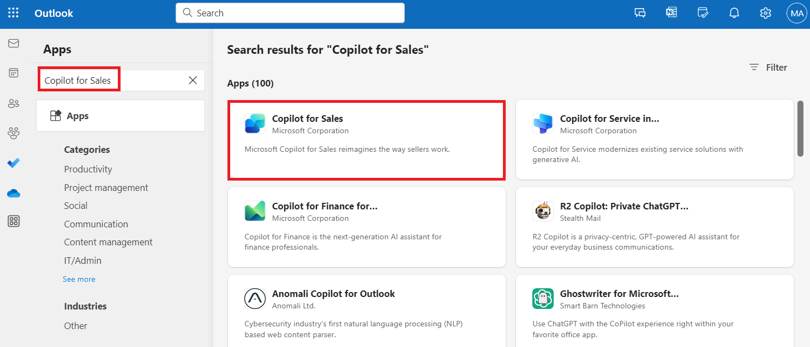

7.  Select **Add** on Copilot for Sales card.

8.  Once again, select **Copilot for Sales** app and click **Open**.

> 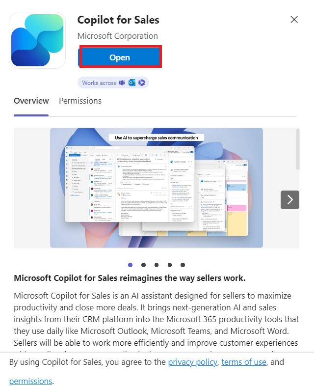

9.  Select **Got it**.

> 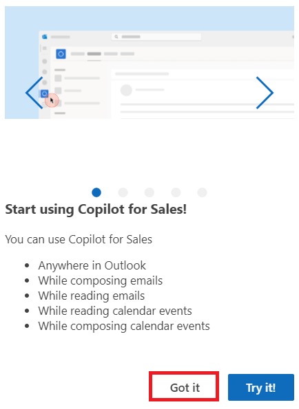

10. Navigate to the **Mails**.

> 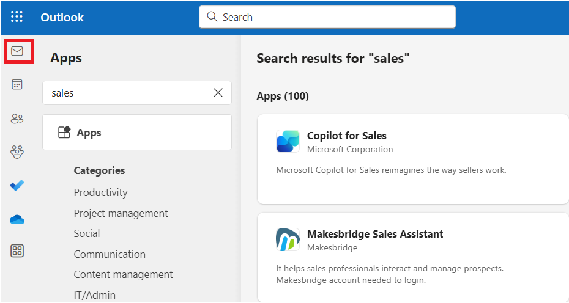

11. Open any of the emails. While in an email, select the **Apps** icon.

> 

12. Now you will be able to see the **Copilot** **for Sales** app.
    Select **Copilot** **for Sales** app.

> 

13. **Sign in** with your **Office 365 admin tenant** credentials in the
    pop-up window.

14. The **Copilot for Sales** pane appears on the right side. Select
    your environment. For this lab, select **Sales Trial** environment.

> 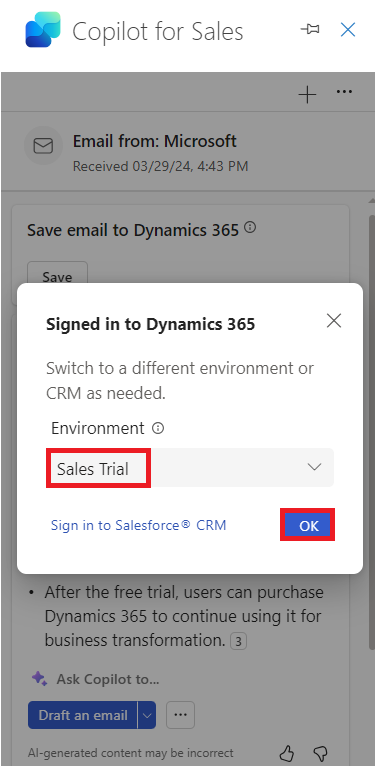

15. Select **Get started**.

> 

16. You can now use the **Copilot** **for** **Sales** pane.

> 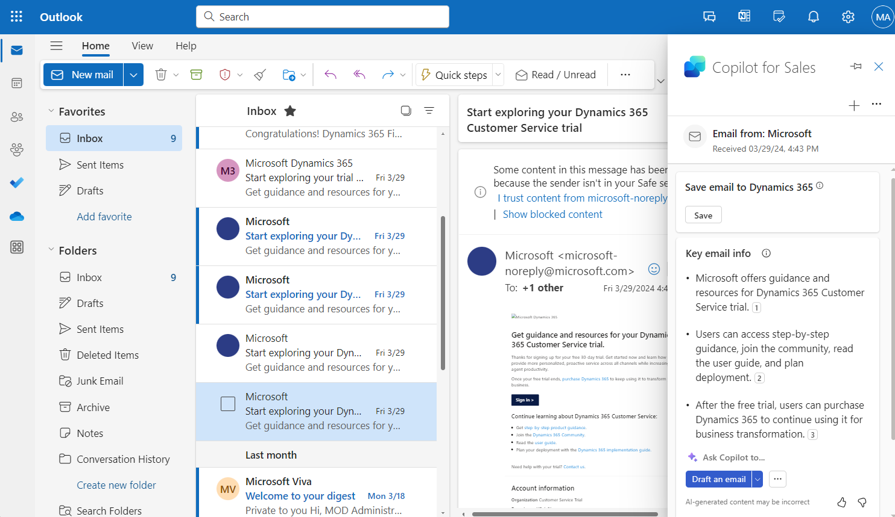

***Tip***

*To keep the **Sales Copilot** pane open across all emails, select
the **Pin** icon.*

## Exercise 2: View and save email summary 

### Task 1: View email summary

1.  In **Outlook**, open a customer email.

2.  Open the **Apps** \> **Copilot** **for** **Sales** pane.

3.  The email summary is displayed in the **Key info** card.

> 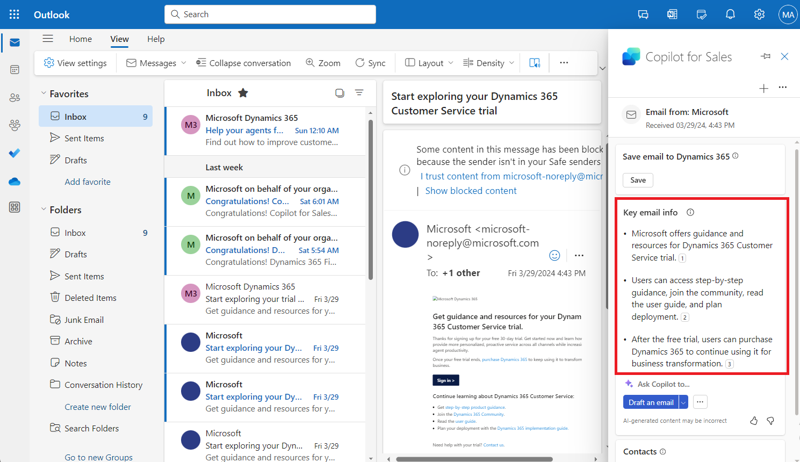

***Note***

*If the email content is less than 1000 characters, the email summary
will not be generated, and the **Key info** card is not displayed.*

### Task 2: Save email summary to CRM

1.  In the **Key info** card, click the ellipses (…) and then select
    **Save summary to Dynamics 365**.

2.  Under **Select a record**, search for Coffee Makers and select one
    of the suggested records or use the search box to find another
    record.

> If there are multiple opportunities related to contact, Copilot for
> Sales displays a list of suggested opportunities, ranked by AI, to
> save the summary. In this case, the first opportunity is selected by
> default.

> **Note**

- If the email is already connected to an opportunity, it's selected by
  default.

&nbsp;

- If no opportunity is connected, the top ranked opportunity, which is
  determined by the open opportunities available for the account or
  contact, and the content of the email, will be selected by default.

&nbsp;

- When you search for a record, the search results display the record
  name and the key fields selected by your administrator.

&nbsp;

- Your search results will be added to the suggested records list, so
  you can safely search and try again.

&nbsp;

- Currently, you can save the summary to one record using Sales Copilot.

&nbsp;

- You can connect to all record types that are enabled for activities
  and added to Sales Copilot by your administrator.

3.  Select **Save**.

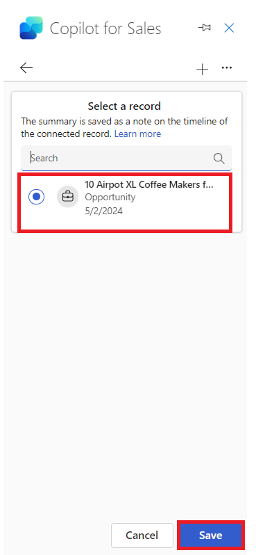

> The email summary is saved to CRM as a note to the selected record.
> All Microsoft Copilot for Sales notes share the same subject: "\[AI
> generated\] Email summary from Sales Copilot" and include the subject
> of the email itself, as well as the timestamp when the note was saved.

## Exercise 3: Create an email reply using Sales Copilot for Microsoft Outlook Add-in

### Task 1: Create an email reply using pre-defined categories

1.  In **Outlook**, open a customer email and select **Reply**.

2.  Select **Apps** and then select **Copilot for Sales**.

> 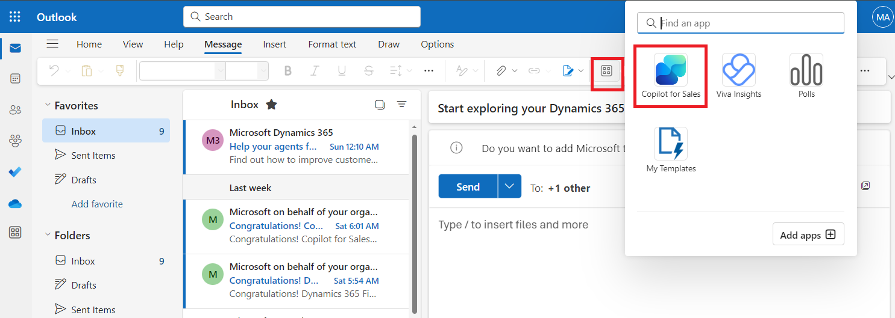

3.  Select **Copilot for Sales**.

> 

4.  Select **Draft an email**.

> 

5.  You can draft an email with the pre-defined categories. Close the
    tip.

> 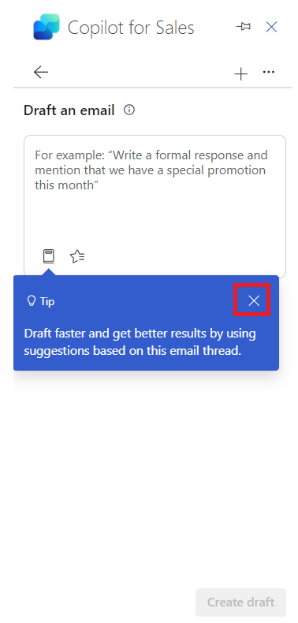

6.  Review the more options. Select any of the more options. For
    example, select **Address a concern**.

> To generate a different suggestion, select **More options**, and then
> select **Try again**. Refine the suggested content, if required. You
> can also restore the suggested content to the previous version.

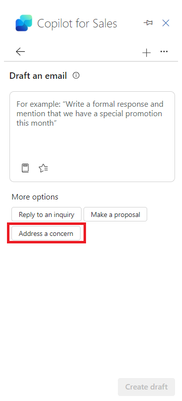

7.  Copilot gathers the required information and gives a response.

8.  Select **Add to email** to paste the content in the email body.

> 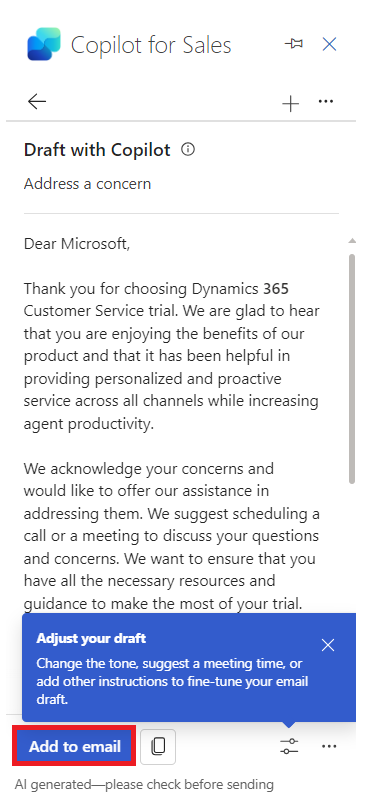
>
> ***Note***
>
> *Existing content in the email body is not replaced. The suggested
> content is prepended to any existing content in the email body.*

9.  Edit the email content as required, and then **Send** it.

> 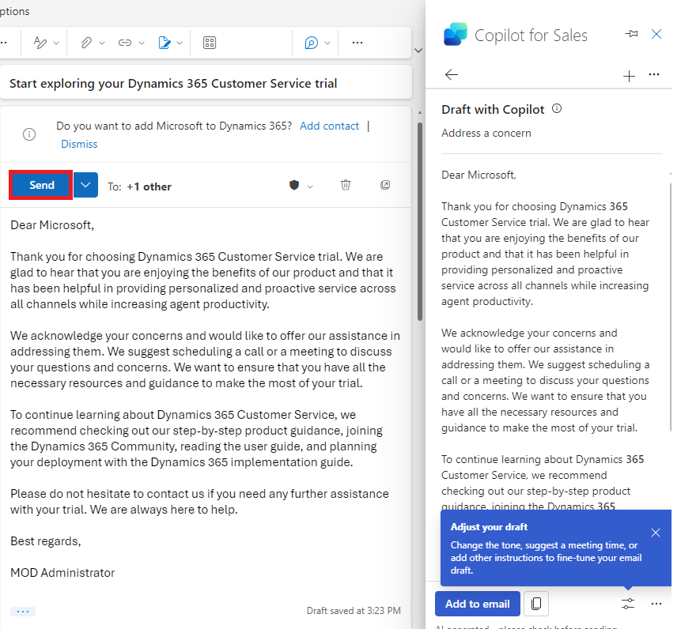

### Task 2: Create an email message using custom prompt

If the pre-defined response categories don't suit your requirements, you
can enter custom prompt to generate suggested content.

You can get suggested email content when you reply to a customer email,
read an email, or compose a new email.

***Note***

- *Information from CRM is not displayed when using custom prompt to
  generated suggested email content.*

- *You can generate suggested content for emails containing internal
  email addresses also. If all email addresses are internal, you'll only
  see the option to enter custom prompt. If you add an external email
  address, pre-defined response categories are made available.*

1.  In **Outlook**, open a customer email and select **Reply**. 

> 

2.  Select **Apps** and then select **Copilot for Sales**.

> 

3.  Select **Copilot for Sales**.

> 

4.  Select **Draft an email**.

> 

5.  In the textbox, enter a phrase to describe the kind of reply you
    want to send, for example ‘Send the acceptance’ and then select
    **Create draft**.

> 

6.  Review the suggested content.

> To generate a different suggestion, select **More options**, and then
> select **Try again**. Refine the suggested content, if required. You
> can also restore the suggested content to the previous version.

7.  Select **Add to email** to paste the content in the email body.

> ***Note***
>
> *Existing content in the email body is not replaced. The suggested
> content is prepended to any existing content in the email body.*

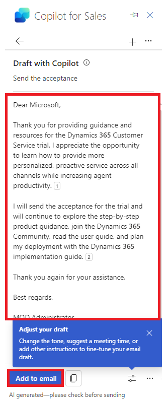

8.  Edit the email content as required, and then **Send** it.

> 

### Task 3: Adjust the email draft

1.  Generate the suggested reply using an appropriate response category.

2.  Select **Adjust draft**.

> 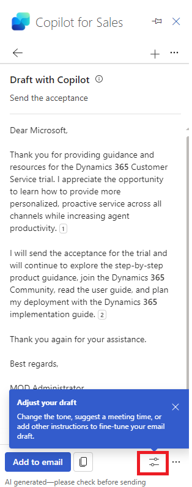

3.  On the **Draft with Copilot** page, select the **Length**, **Adjust
    tone** and **Suggest a meeting time** tabs as per your requirements
    and then select **Update**.

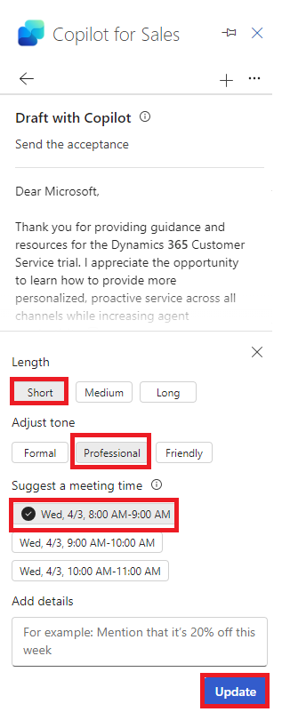

4.  Review the suggested content.

> To generate a different suggestion, select **More options**, and then
> select **Try again**. Refine the suggested content, if required. You
> can also restore the suggested content to the previous version.

5.  Select **Add to email** to paste the content in the email body
    or **Copy content** when you are reading an email.

> ***Note***
>
> *Existing content in the email body is not replaced. The suggested
> content is prepended to any existing content in the email body.*
>
> 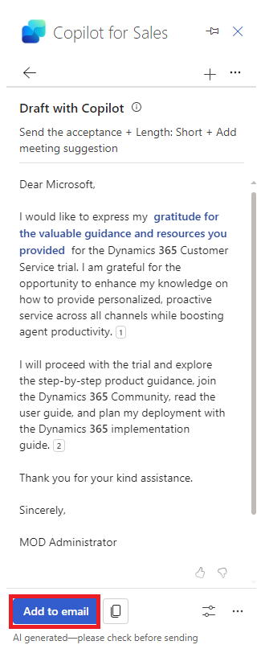

6.  Edit the email content as required, and then **Send** it.

> 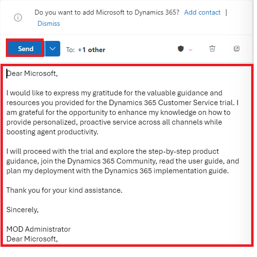

## Exercise 4: Add or remove meeting suggestion

By default, a meeting time is not included in the suggested content. If
a customer has requested a meeting at a certain time and mentioned the
same in an email, the meeting time is included in the suggested content.
The meeting time displayed in the suggested content is in your time
zone.

### Task 1: Add a meeting time suggestion

If you want to have a meeting with a customer, you can include a meeting
time in the suggested content. The meeting time suggested is the first
available slot in your calendar.

1.  In **Outlook**, open a customer email and select **Reply**.

> 

2.  Select **Apps** and then select **Copilot for Sales**.

> 

9.  Select **Copilot for Sales**.

> 

3.  Select **Draft an email**.

> 

4.  Select a pre-defined category.

5.  Review the suggested content. Select any of the suggested content.
    For example, select **Address a concern**.

> To generate a different suggestion, select **More options**, and then
> select **Try again**. Refine the suggested content, if required. You
> can also restore the suggested content to the previous version.

6.  Copilot gathers the required information and gives a response.

7.  Select **Adjust draft**.

8.  Under **Suggest a meeting time**, select the meeting time displayed.

9.  Select **Update**.

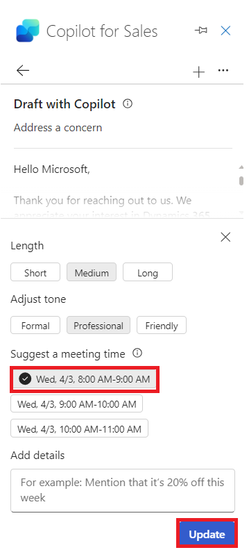

10. Select **Add to email** to paste the content in the email body.

> 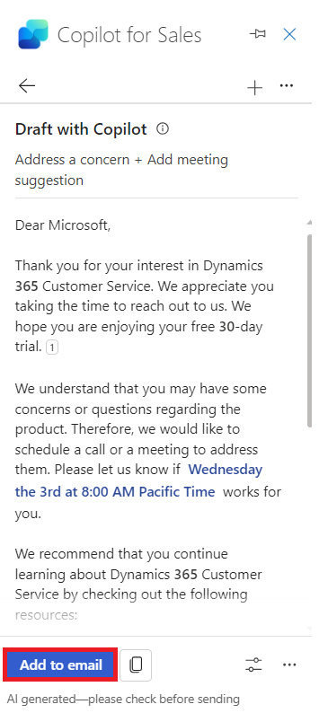

11. Edit the email content as required, and then **Send** it.

> 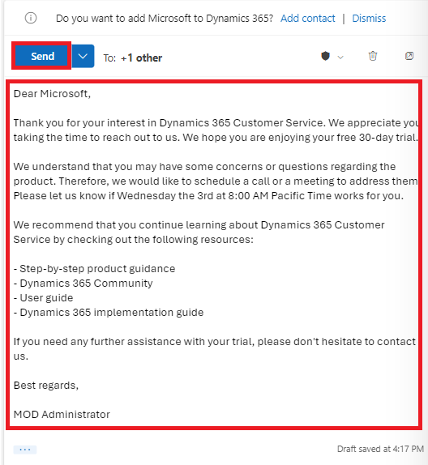

### Task 2: Remove the meeting time suggestion

1.  Generate the suggested content using an appropriate response
    category.

2.  Select **Adjust draft**.

3.  Under **Suggest a meeting time**, clear the meeting time selected.

4.  Select **Update**.

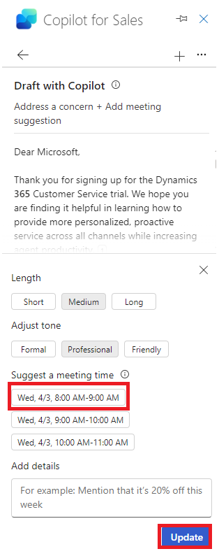

## Exercise 5: View opportunity summary

1.  In **Outlook,** open an email or the scheduled meeting.

2.  Open the **Copilot for** **Sales** pane. Click **Save** **email to
    Dynamics 365**.

3.  On the **First, turn on server-side sync** dialog, select **Turn
    on**.

4.  On **Connect to a record** page, search for the contact using the
    search box.

5.  Select the contact and click **Save**.

6.  Once the email is saved to the record of the selected contact, a
    message is displayed on the **Copilot for Sales** pane.

7.  Select the contact. You will be navigated to the **Contact details**
    page.

8.  On the **Contact details** page, go to the **Opportunities** area
    and select one of the opportunities.

9.  The **Opportunity summary** and **Opportunity details** are
    displayed in the **Opportunity info** card.

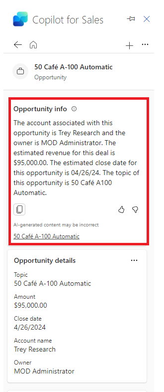
