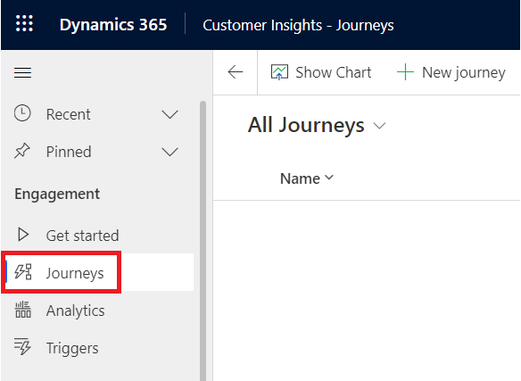
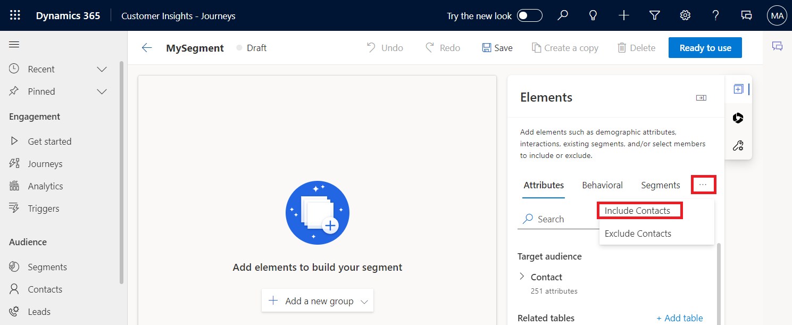
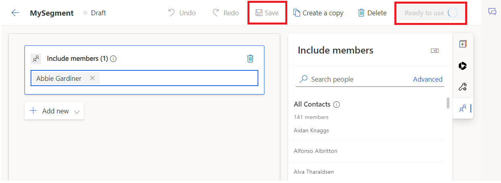
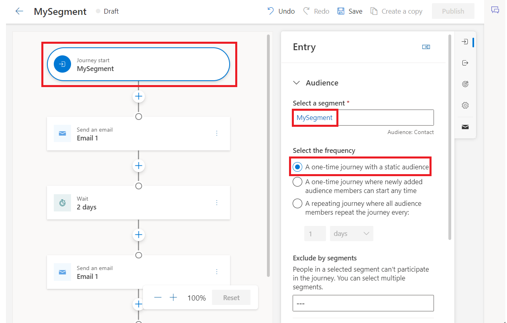

# **Lab 13: Creating AI-Assisted customer journey with Copilot in Customer Insights - Journeys**

## Task 1: Using the journey copilot

Now, let’s imagine you want to create a welcome journey for people who
recently joined your program. To create a journey with Copilot

1.  Select **Customer Insights – Journeys**.

> 

2.  Select the **Journey** tab under **Engagement**.

> 

3.  Then select **New Journey**, which opens the journey copilot window.

> 

4.  Enter “Create a journey that will send a welcome email to all
    customers that are part of the MySegment segment. After two days,
    send them an exclusive offer email.” And then select **Send** icon.

> 

5.  Copilot processes the prompt and asks to select Segment. To create a
    segment, click on Look for segments and then select **+ New
    Segment**.

> 

6.  Name the segment as **MySegment** and select **Contact** a target
    audience.

> 

7.  Select **Save**.

> 

8.  Under Elements pane, select more options ( 3 dots)next to segments
    and then select **Include Contacts.**

> 

9.  On left side under Include contacts, click on **manually select
    members** and click on the **first contact** under the Include
    member panel.

> 

10. Select **Save** and then select **Ready to use**.

> 

11. You can see the response with a journey suggestion that includes the
    automatically detected segment and each subsequent step clearly.

> 

12. Once you're satisfied with the suggested journey, select **Create
    journey** and the journey will be automatically created for you. You
    can use the icon for **thumbs up** and **thumbs down** on the right
    side to provide feedback on the copilot and help it improve over
    time.

> 

13. Select MySegment step. Select the frequency as **one time journey
    with static audience** and select the **future time** for the start
    time journey.

> 

14. Select second step Email1. Enter **Email1** under Select email and
    for send to select **Email**.

> 

15. Repeat the same for fourth step Email1.

> 

16. Select **Save**.

> 

17. Select **Publish**.

> 
