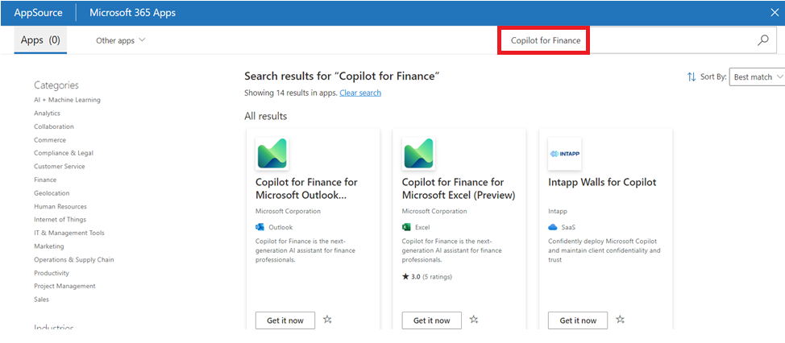
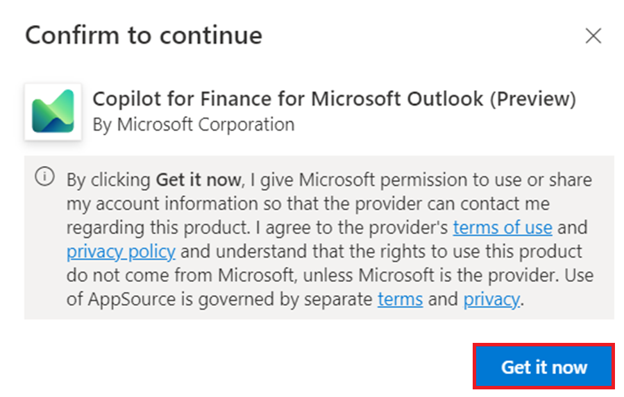
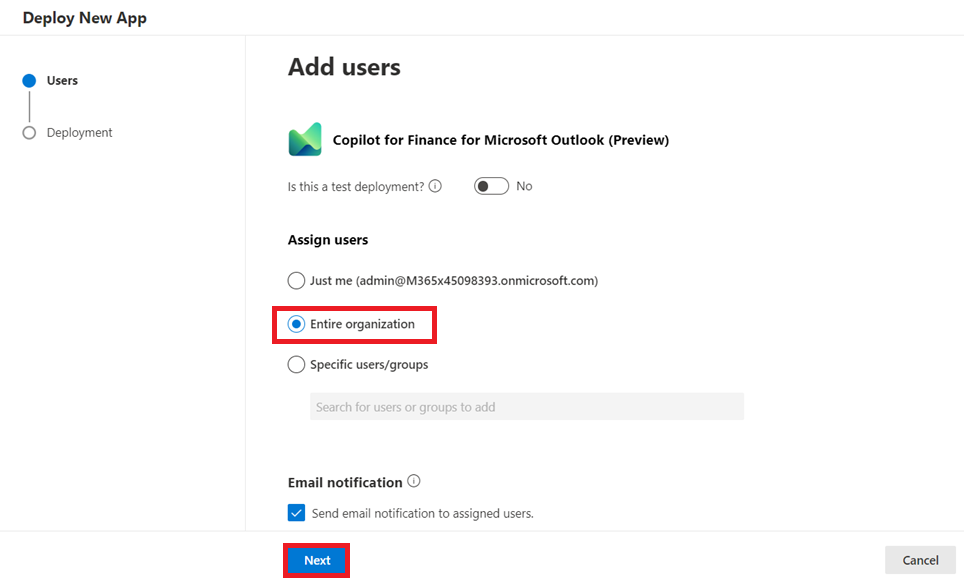
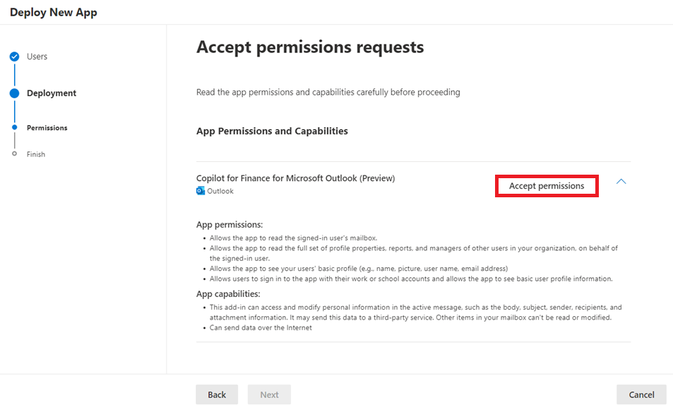
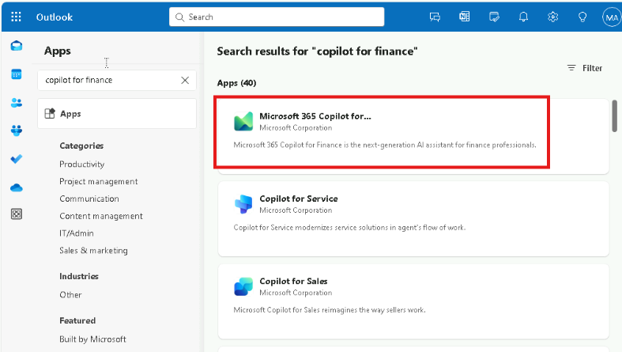
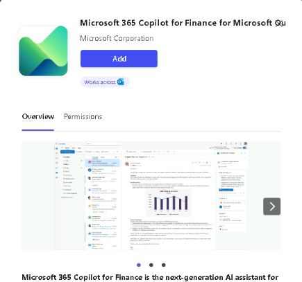
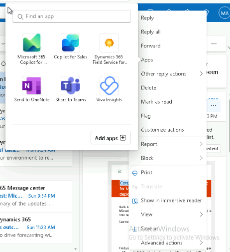
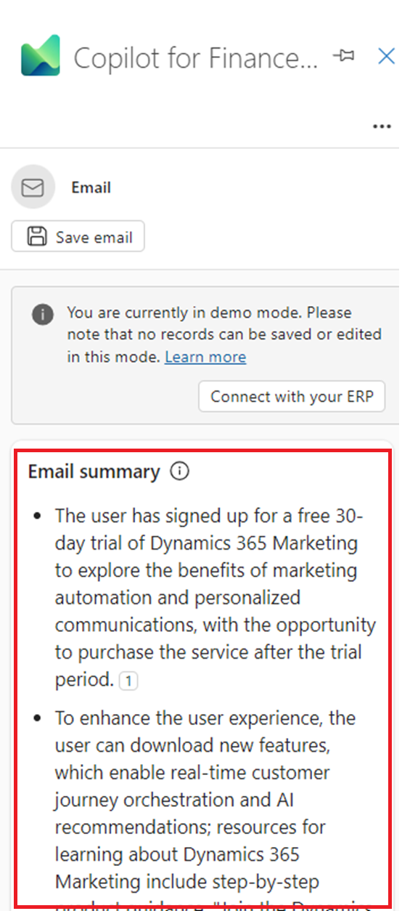

# **Lab 15: Using Copilot for Finance in Outlook**

## **Task 1: Install the Copilot for Finance for Outlook add-in from the Microsoft 365 admin center**

To install the Copilot for Finance for Outlook add-in from the Microsoft
365 admin center, follow these steps.

1.  Sign in to the Microsoft 365 admin center with the given link
    <https://admin.microsoft.com/>.

2.  In the left pane, select **Settings** \> **Integrated apps**.

> 

3.  On the **Integrated apps** page, select **Get Apps**.

> 

4.  In the AppSource window, search for **Copilot for Finance**.

> 

5.  In the search results, select **Copilot for Finance for Outlook**,
    and then select **Get it now**.

> 

6.  Click on **Get it now** on Confirm to continue window.

> 

7.  In the **Users** step, select **Entire organization** under Assign
    users then select **Next**.

> 

8.  In the **Deployment (Permissions)** step, review the app permissions
    and capabilities in connection with Copilot for Finance,
    select **Accept permissions**.

> 

9.  When you see that permissions are accepted then select **Next**.

> 

10. In the **Deployment (Finish)** step, review the selected settings,
    and then select **Finish deployment**.

> 

11. When the deployment is completed, select **Done**.

> 

## **Task 2: Generating email summary in Demo mode, viewing contact details and adding notes**

1.  Now, Go to Outlook, open any mail, click on **Apps** and then click
    on **Add apps**.

> 

2.  In the search bar, type **Copilot for Finance** and then select it
    from the Apps list.

> 

3.  Select **Add**.

> 

4.  Select **Try it** to start using Copilot for Finance.

> 

5.  Now open Outlook and go to the email that you want to analyze. On
    the top menu for the selected email, select **All Apps**. Select
    the **Copilot for Finance** app.

> 

6.  On the **Welcome** page, select **Try demo mode**.

> 

7.  Click on **Next** on the pop-up window of ‘Stay in the flow of your
    work’. Click on Next till you get Try now button.

> 

8.  When you see **Try now** button, click on that.

> 

9.  You can see email summary.

> 

10. If you want suggestions to reply the email, click on **Suggest a
    reply**. To save, regenerate or copy the email summary, click on 3
    dots (**…**) next to Suggest a reply.

> 

11. You can also see the customers and contacts saved in your ERP.

> 

12. Click on the customer name **Fabrikam**.

> 

13. You can see the customer details, outstanding invoices and related
    activities.

> 

14. Click on the **back arrow** to come back to the home screen of
    Copilot for Finance.

> 

15. Now scroll down and select **New note** under Notes section at the
    end.

> 

16. You can save the note by selecting the customer that you want to
    associate the note with.
